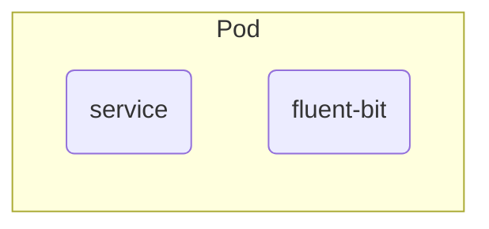

## TL;DR
CI/CD 基礎建設重構
GCP 上的基礎建設重構

## 背景
隨著 Side project 的成長
將一些過去較投機取巧的方式重新正規劃
包含 `IaC`、`CI` & `CD` 環境

目前的 `CI/CD` 是使用共用的 `Gitlab-runner` 處理 `CI` 並配合 `Gitlab-Agent` 來完成 `CD`
但相關 `IaC` 的調整，目前都是透過在本地執行，再推到 Gitalb 上作版控
所以我們在 `IaC` 這段的 `CI/CD` 是不完整的

### GKE 環境的 Gitlab-runner
在建置 `Gitlab-runner` 須額外考量，其他環境更新時，不應該影響到 Runner
故可以在建立一個獨立 `VM` 或是 `Cluster` 來處理這段的問題

這邊我選擇額外建置一個 GKE 作為 Runner 環境，除了 `環境獨立` 以外，也讓 runner 保有 K8s 擴縮的彈性

### 取得 Gitlab-runner accessToken
Runner 還有分成 Group-base & Project-base
因為我是多個 Project 都在同一個 Group，想共用同一套 Runner
所以我這邊選擇 Group-base 的 runner


### Gitlab-runner Helm 設置
[官方 Helm repo](https://gitlab.com/gitlab-org/charts/gitlab-runner/blob/main/values.yaml)

控制併發上限
```
runnerToken: "glrt-xxxxxxxx"      # 這邊放入剛剛取得的 token

## Configure the maximum number of concurrent jobs
## ref: https://docs.gitlab.com/runner/configuration/advanced-configuration.html#the-global-section
concurrent: 5                     # default 是 10, 我這邊需求量還沒那麼大，先降到 5

gitlabUrl: "https://gitlab.com/"  # 提供你所使用的 gitlab-server 網址
# resources:                      # 要調整或使用 defualt setup 都可以
#   limits:
#     memory: 500Mi
#     cpu: 150m
#     ephemeral-storage: 512Mi
#   requests:
#     memory: 500Mi
#     cpu: 150m
#     ephemeral-storage: 512Mi

runners:
  name: "cosparks-runner"         # 我們給 runner 的命名
  executor: kubernetes            # 我們執行的環境是 K8s
  tags: "test"                    # 剛剛的 tags
  
  # 這邊為了可以執行 Docker in Docker，所以需要 "privileged=true" 的設置
  config: |
    [[runners]]
      [runners.kubernetes]
        privileged = true
        namespace = "{{ default .Release.Namespace .Values.runners.jobNamespace }}"
        image = "alpine"

```

接著只要


