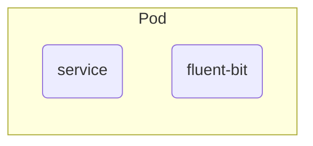

## Retrieval Augmented Generation (RAG)

檢索增強生成
文章難易度：★★☆☆☆

🌟 本篇著重在
- **什麼是 RAG 及其應用**

🌟 過程中會簡介
- 什麼是 LLM，背後運作機制概念
- 什麼是 NLP

🌟 最後帶入一些實際關於 RAG 的範例



## ❓ What is LLM
✅ 一個文字接龍的生成式模型
- LLM的回應生成，可以粗略的視為
    👉 回應句子的每一個字都是機率算出來的
    👉 且每個位置的每個字，其機率都不同

    | 第一個字生成 | 選擇               |
    | ------------ | ------------------ |
    | 我： 10%     |
    | 台： 80%     | ✅ |
    | 灣： 15%     |
    | ...          |
    | 是： 55%     |
    | 玉： 45%     |
    | 山： 25%     |

    👉 LLM生成：台

    | 第二個字生成 | 選擇               |
    | ------------ | ------------------ |
    | 我： 10%     |                    |
    | 台： 25%     |                    |
    | 灣： 70%     | ✅ |
    | ...          |                    |
    | 是： 30%     |                    |
    | 玉： 45%     |                    |
    | 山： 35%     |                    |

    👉 LLM生成：台灣

✅ 有時會產生幻覺
- 機率的文字接龍
    👉 由於回應的內容都是機率算出來的，所以他對於「自己知道什麼 與 不知道什麼」是沒有辦法瞭解的

✅ 沒有認知邊界

## ❓ What is NLP
✅ NLP(Natural Language Processing) 即是自然語言處理
- ML 的訓練結果如潘朵拉的盒子
    👉 ML 訓練出來的模型，每次結果的好壞是較難以預測，且費時
    👉 NLP 的訓練過程與結果相對容易控制

## ❓ What is RAG
✅ RAG 是基於 NLP 發展出來的一種技術

✅ 為 LLM 加上外掛
- 使用既有的 LLM 外掛我們的資料
    👉 前面提到 LLM 並沒有「認知邊界」，在 RAG 透過把 特定範圍的知識 ***外掛*** 給 LLM，使其可以針對該知識集資料回答問題

✅ 訓練成本低


## RAG 最基本的可以分成兩大部分

1. 資料外掛
2. 資料檢索與生成

### 🌟 資料外掛
將 LLM 的認知範圍，限縮鎖定在我們希望的特定範圍內
我們會將這些特定範圍的資料，以 Embedding 的方式儲存在資料庫

*Embedding 是一種將物件(如：單詞、句子、圖片、檔案)向量化的方式(結果通常是一個數學矩陣)*

❗ 由於機器並不認得我們的自然語言，在機器的世界裡，都是 0,1 的數字，所以我們透過 Embedding 的技術，機器才得以認得我們的語言

### 🌟 資料檢索與生成
有了這些資訊，我們即可透過 自然語言的方式做提問(Query)，把 Query 也用 Embedding 的方式，讓機器去資料庫找到最相似的資訊(Data)

最後把 Query + Data 用自然語言的方式整合成一個 Prompt 提供給 LLM
讓 LLM 針對這個 Prompt 來產生回應

## 🌟 Demo
👉 資料(documents) Embedding，並儲存到資料庫(chromadb)
- LLM 模型使用 llama2
- 資料庫使用 ChromaDB

```python
import ollama
import chromadb

documents = [
  "Llamas are members of the camelid family meaning they're pretty closely related to vicuñas and camels",
  "Llamas were first domesticated and used as pack animals 4,000 to 5,000 years ago in the Peruvian highlands",
  "Llamas can grow as much as 6 feet tall though the average llama between 5 feet 6 inches and 5 feet 9 inches tall",
  "Llamas weigh between 280 and 450 pounds and can carry 25 to 30 percent of their body weight",
  "Llamas are vegetarians and have very efficient digestive systems",
  "Llamas live to be about 20 years old, though some only live for 15 years and others live to be 30 years old",
]

client = chromadb.Client()

# collection exits ? use it || create one
try:
    collection = client.create_collection(name="docs")
except Exception as e:
    if "Collection docs already exists" in str(e):
        collection = client.get_collection(name="docs")
    else:
        raise e

# ID check
existing_docs = collection.get()
existing_ids = set(existing_docs['ids'])

# Document vectorize and store into vector database
for i, d in enumerate(documents):
    if str(i) in existing_ids:
        print(f"ID {i} already exists, skipping.")
        continue

    response = ollama.embeddings(model="mxbai-embed-large", prompt=d)
    embedding = response["embedding"]
    collection.add(
        ids=[str(i)],
        embeddings=[embedding],
        documents=[d]
    )
```

👉 將 Query Embedding 後，到資料庫找到最相似的資料(data)

```python
Query = "What animals are llamas related to?"

# vectorize and embeddings
response = ollama.embeddings(
  prompt=Query,
  model="mxbai-embed-large"
)
results = collection.query(
  query_embeddings=[response["embedding"]],
  n_results=1
)
data = results['documents'][0][0]
```

👉 將 Query + data 整合成一個 Prompt 讓 LLM 針對這個 Prompt 產生回應 👉output['response']

```python
ollama.pull(model="llama2")
# response
output = ollama.generate(
  model="llama2",
  prompt=f"Using this data: {data}. Respond to this prompt: {Query}"
)

print(output['response'])
```
👉 回應範例
```
Llamas are members of the camelid family, which means they are closely related to other animals such as:

1. Vicuñas: Vicuñas are small, wild relatives of llamas and alpacas. They are native to South America and are known for their soft, woolly coats.
2. Camels: As the name suggests, camels are also members of the camelid family. They are known for their large size, long eyelashes, and ability to survive in hot, dry environments.
3. Alpacas: Alpacas are domesticated animals that are closely related to llamas and vicuñas. They are native to South America and are known for their soft, luxurious fibers.

So, to summarize, llamas are related to vicuñas, camels, and alpacas. These animals share similar physical and behavioral characteristics due to their shared evolutionary history within the camelid family.
```

---
延伸閱讀：
- [RAG Optimize: Data-Chunk](https://hackmd.io/xOaOwrINQL6f7I5MTsPbgQ)

#### Figure-out
- infra of Re-Ranking(how does it works)
- collection schema design(base on what?)
- Active RAG

#### Optimize brainstorming (待驗證)
- 透過 Query 持續強化學習, two db control ( source-data / query optimize )
- mixture of GraphDB?
- optimize "prompt" with different type of Query question to execute different processes
- embedding full-context / key-context 

#### interface
- Slack
- Line

關鍵字 : AI, ML, NLP, RAG, Embeddings
