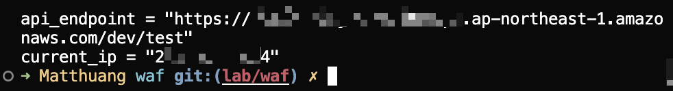
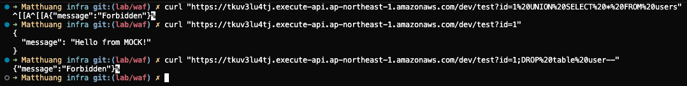
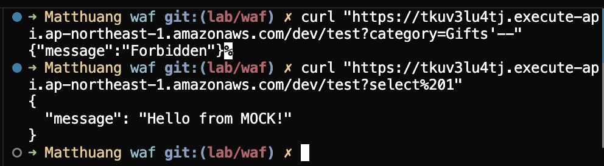
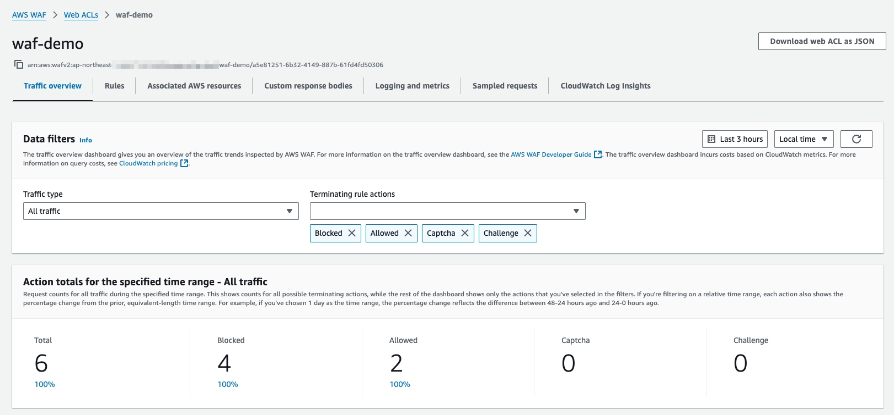
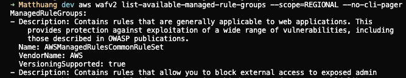
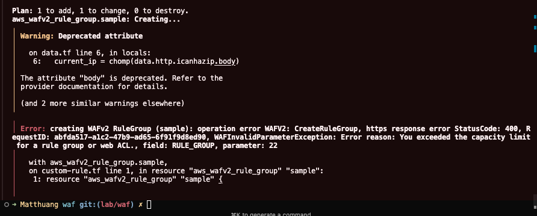
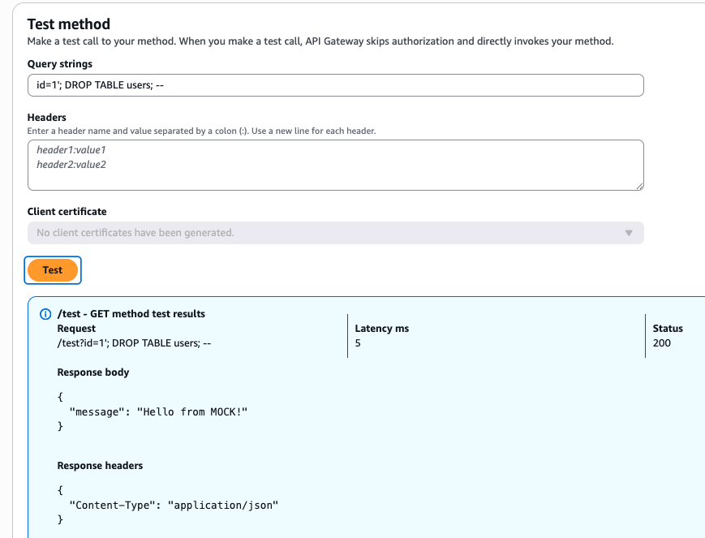

## TL;DR

AWS 上的 WAF 設置，以 SQL-injection 防護為例

## AWS WAF 於 Terraform 上的主要組件

- [aws_wafv2_web_acl](https://registry.terraform.io/providers/hashicorp/aws/latest/docs/resources/wafv2_web_acl)
    - scope: 作用域，可填入 `REGIONAL` 或 `CLOUDFRONT`，若使用`CLOUDFRONT` 也必須明確指定 `REGION`
- [aws_wafv2_ip_set](https://registry.terraform.io/providers/hashicorp/aws/latest/docs/resources/wafv2_ip_set)<br/>設置 ip 黑名單
- [aws_wafv2_regex_pattern_set](https://registry.terraform.io/providers/hashicorp/aws/latest/docs/resources/wafv2_regex_pattern_set)
- [aws_wafv2_rule_group](https://registry.terraform.io/providers/hashicorp/aws/latest/docs/resources/wafv2_rule_group)
規則群組
- [aws_wafv2_web_acl_association](https://registry.terraform.io/providers/hashicorp/aws/latest/docs/resources/wafv2_web_acl_association)
主要負責把 waf 指向給 aws resource
`CloudFront` 則是例外，會直接寫在 `aws_cloudfront_distribution` module 內
- [aws_wafv2_web_acl_rule_group_association](https://registry.terraform.io/providers/hashicorp/aws/latest/docs/resources/wafv2_web_acl_rule_group_association)
主要負責 rule 的管理，並指向對應的 waf
- [aws_wafv2_web_acl_logging_configuration](https://registry.terraform.io/providers/hashicorp/aws/latest/docs/resources/wafv2_web_acl_logging_configuration)
會有頻繁操作，或者 WAF rule 太大頂到上限的問題
可以 log 蒐集, logging fileter...

### 實作部署具備 SQL-Injection 防務的 WAF

```tf
# waf 設置

resource "aws_wafv2_web_acl" "demo" {
  name        = "waf-demo"
  description = "Demo WAF with IP deny + SQLi"
  scope       = "REGIONAL"

  default_action {
    allow {}
  }

  visibility_config {
    cloudwatch_metrics_enabled = true
    metric_name                = "waf-demo"
    sampled_requests_enabled   = true
  }

  rule {
    name     = "sqli_protection"
    priority = 2
    override_action {
      none {}
    }

    statement {
      # aws wafv2 list-available-managed-rule-groups --scope=REGIONAL
      managed_rule_group_statement {
        name        = "AWSManagedRulesSQLiRuleSet"
        vendor_name = "AWS"
      }
    }

    visibility_config {
      cloudwatch_metrics_enabled = true
      metric_name                = "sqli_protection"
      sampled_requests_enabled   = true
    }
  }
}

```
```tf
# mock api-gateway

resource "aws_api_gateway_rest_api" "demo" {
  name        = "waf-test-api"
  description = "REST API for WAF demo"
}

resource "aws_api_gateway_resource" "test" {
  rest_api_id = aws_api_gateway_rest_api.demo.id
  parent_id   = aws_api_gateway_rest_api.demo.root_resource_id
  path_part   = var.api_path
}

resource "aws_api_gateway_method" "get" {
  rest_api_id   = aws_api_gateway_rest_api.demo.id
  resource_id   = aws_api_gateway_resource.test.id
  http_method   = "GET"
  authorization = "NONE"
}

resource "aws_api_gateway_integration" "mock" {
  rest_api_id   = aws_api_gateway_rest_api.demo.id
  resource_id   = aws_api_gateway_resource.test.id
  http_method   = aws_api_gateway_method.get.http_method
  type          = "MOCK"

  request_templates = {
    "application/json" = "{ \"statusCode\": 200 }"
  }
}

resource "aws_api_gateway_method_response" "get_200" {
  rest_api_id = aws_api_gateway_rest_api.demo.id
  resource_id = aws_api_gateway_resource.test.id
  http_method = aws_api_gateway_method.get.http_method
  status_code = "200"
  response_models = {
    "application/json" = "Empty"
  }
}

resource "aws_api_gateway_integration_response" "get_200" {
  rest_api_id = aws_api_gateway_rest_api.demo.id
  resource_id = aws_api_gateway_resource.test.id
  http_method = aws_api_gateway_method.get.http_method
  status_code = aws_api_gateway_method_response.get_200.status_code
  response_templates = {
    "application/json" = <<EOF
{
  "message": "Hello from MOCK!"
}
EOF
  }
}

resource "aws_api_gateway_deployment" "demo" {
  rest_api_id = aws_api_gateway_rest_api.demo.id

  depends_on = [
    aws_api_gateway_integration.mock
  ]
}

resource "aws_api_gateway_stage" "demo" {
  rest_api_id   = aws_api_gateway_rest_api.demo.id
  deployment_id = aws_api_gateway_deployment.demo.id
  stage_name    = var.api_stage
}

```

```
# main.tf

terraform {
  required_version = "~> 1.12"

  required_providers {
    aws = {
      source  = "hashicorp/aws"
      version = "6.9.0"
    }

    http = {
      source  = "hashicorp/http"
      version = "3.5.0"
    }
  }

  backend "s3" {
    bucket              = "bucket-name"
    key                 = "lab/infra/waf.tfstate"
    allowed_account_ids = ["5xxxxxxxxxx0"]
    region              = "ap-northeast-1"
    dynamodb_table      = "tf-locks"
    profile             = "tf-profile"
  }
}


provider "aws" {
  region              = "ap-northeast-1"
  profile             = "tf-profile"
  allowed_account_ids = ["5xxxxxxxxxx0"]

  default_tags {
    tags = {
      Managed = "terraform"
      Source  = "lab/infra/waf"
    }
  }
}

```
可以在完成部署後取得測試 url


### 實測
嘗試用 SQLi 攻擊
```
# 嘗試 union 查詢
curl "https://{api-gateway-id}.execute-api.ap-northeast-1.amazonaws.com/dev/test?id=1%20UNI0N&20SELECT&20*&20FROM&20users"

# 單純 select "1"
curl "https://{api-gateway-id}.execute-api.ap-northeast-1.amazonaws.com/dev/test?id=1"
```


確認並非所有的 SQL 都會被 WAF 擋<br/>
並且可以在 dashboard 查看紀錄


### Managed WAF rules 列表
可以透過
```
aws wafv2 list-available-managed-rule-groups --scope=REGIONAL
```
找到可使用的 aws 託管的 WAF rule


---

### 踩坑列表

> rule_capacity 不足

```
Error reason: You exceeded the capacity limit for a rule group or web ACL., field: RULE_GROUP, parameter: 22
```



若有部署 rule_group，會需要設置 capacity，若部署過程中出現下列告警，表示 `rule_capacity` 不夠用了

> AWS Consoel 中 API gateway 的 Test 不會過 WAF?



測試過程中發現 Console 內相關 SQLi 的語法都沒有被擋下來
然而相關細節目前無法在 AWS 的文件中找到 但測試文件有都是以 curl 為例
[文件連結](https://aws.amazon.com/tw/blogs/compute/amazon-api-gateway-adds-support-for-aws-waf/)
故只能推測為路徑不同導致
