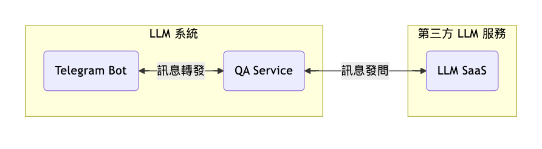
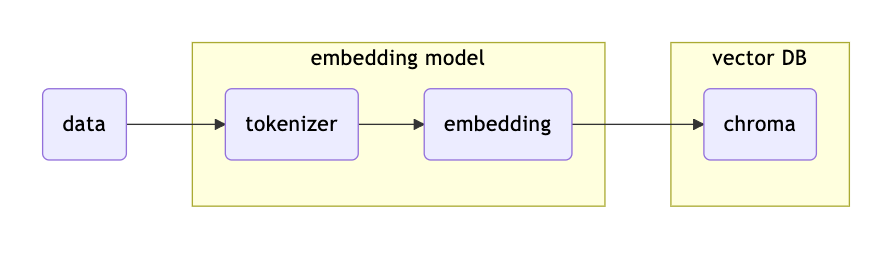
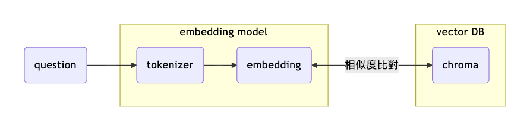

### 最簡單的架構
可以用任何第三方 interface 介接，這邊以 Telegram Bot 為例
透過 TG 作為介面，在裡面埋一個 `TG-Bot` 作為訊息接收的 `interface`
這樣系統架構會接信下面這樣
而其中 `QA Service` 對 `LLM SaaS` 的 `訊息發問` 中，至少會需要附帶 `System Prompt` & `User Prompt` 兩個訊息

### 使用 `LLM SaaS` 的幾個基礎
- System-Prompt & User Prompt
    - system-prompt 主要用於 `define 問答的 Scope`
    - User Prompt 則是針對這個 Scope 的提問
- structured output
    定義 output 必須要的結構，適用於 output 的資料需要做額外處理
- function calling
    給予 LLM 工具箱，讓他有能力 `決定` 要執行哪個 function
    
### System-Prompt 的資料膨脹
隨著越來越多資訊想放入 `QA-Bot`, `System-Prompt` 的膨脹是一定會面對到的問題

而我們都知道，雖然 LLM 的 `Context` 可以一次提供 1M 甚至更多的 Token
但現階段的 LLM 由於 `注意力機制` 的問題，LLM 對於 `Long Context` 會更傾向於只關注`開始`與`結尾`的訊息，因此對`完整細節的資訊`獲取能力會下降

為了解決這個問題，我們會開始為整個大的 `System Prompt` 劃分知識區塊
拆成更小的 `知識框架`

### 知識區塊取得
當我們成功劃分好知識區塊之後，我們該怎麼讓使用者提出 `User Prompt` 的時候，可以給 LLM 對應知識區塊的 `System Prompt` 呢？

這邊給出兩種參考方式 `function calling`, `RAG`

### RAG
RAG 是一種把資料向量化並且使用這些向量資料的技術
RAG 有幾個重點，`向量相似度`, `embedding model`, `tokenizer`
在資料向量化的過程大概如下

餵進來的 `data` 會先經過 `embedding model` 做 `tokenize`
之後再針對這些 `tokenize` 後的 context 做 `embedding`

什麼是 `embedding` 呢？
embedding 就是一種把 `文字` 轉換成 [ 0 , 1 ] 的過程
而 0 跟 1 才是機器碼能識別的內容，進而才有辦法去做 `Similarity`

而資料在比對的過程大概如下

在上面這個流程呢
我們的 `question` 還是會經過 `embedding model` 做 `tokenize` & `embedding` 產出屬於 `question` 的 0 跟 1 的資料(以下簡稱 `data-q`)
接著，再把 `data-q` 丟到向量資料庫 `chroma` 做向量的 `similarity`
從向量資料庫找到相似度最高的資料(以下簡稱 `data-doc`)

接著我們就可以把找到的 `data-doc` 與 `question` 整合後提供給 LLM 來幫我們產生回覆

### Function calling
`Function calling` 是 `LLM` 的一種特別用法
透過 define 好 LLM 可以使用的工具
讓 LLM 可以 `決定` 他要運行哪一個 Function ，並且還可以取得 `Function` 的 `Params`

這邊參考 OpenAI 官方對於 `function calling` 的文件
簡易演示什麼是 `function calling`
ref: [link](https://platform.openai.com/docs/guides/function-calling?api-mode=responses)
```python
# input
from openai import OpenAI

client = OpenAI()

tools = [{
    "type": "function",
    "name": "get_weather",
    "description": "Get current temperature for a given location.",
    "parameters": {
        "type": "object",
        "properties": {
            "location": {
                "type": "string",
                "description": "City and country e.g. Bogotá, Colombia"
            }
        },
        "required": [
            "location"
        ],
        "additionalProperties": False
    }
}]

response = client.responses.create(
    model="gpt-4.1",
    input=[{"role": "user", "content": "What is the weather like in Paris today?"}],
    tools=tools
)

print(response.output)
```

```json
// output
[{
    "type": "function_call",
    "id": "fc_12345xyz",
    "call_id": "call_12345xyz",
    "name": "get_weather",
    "arguments": "{\"location\":\"Paris, France\"}"
}]
```
從 output 的結果可以看到
他可以決定要執行的 `function` 以及相關必要的 `params`

因此，我們可以把上面的 code 稍微調整一下
```python
# input
from openai import OpenAI

client = OpenAI()

tools = [{
    "type": "function",
    "name": "gke_cluster_info",
    "description": "Get current cluster monitoring info.",
    "parameters": {
        "type": "object",
        "properties": {
            "product": {
                "type": "string",
                "enum": [
                    "bbin",
                    "bbgp"
                ],
            },
            "group": {
                "type": "string",
                "enum": [
                    "outside",
                    "inside"
                ],
            },
        },
        "required": [
            "product",
            "group"
        ],
        "additionalProperties": False
    }
}]

response = client.responses.create(
    model="gpt-4.1",
    input=[{"role": "user", "content": "現在 bbin outside 的情況?"}],
    tools=tools
)

print(response.output)
```
在上面的例子，我們進一步透過 enum 進一步限制可用參數
因此，我們可以讓 `gke_cluster_info` 在 process 更清楚知道要到哪個 `gke-clsuter` 去取資訊

