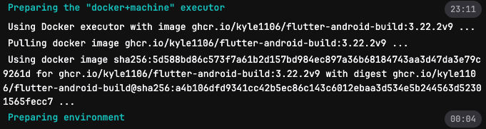
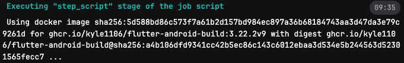
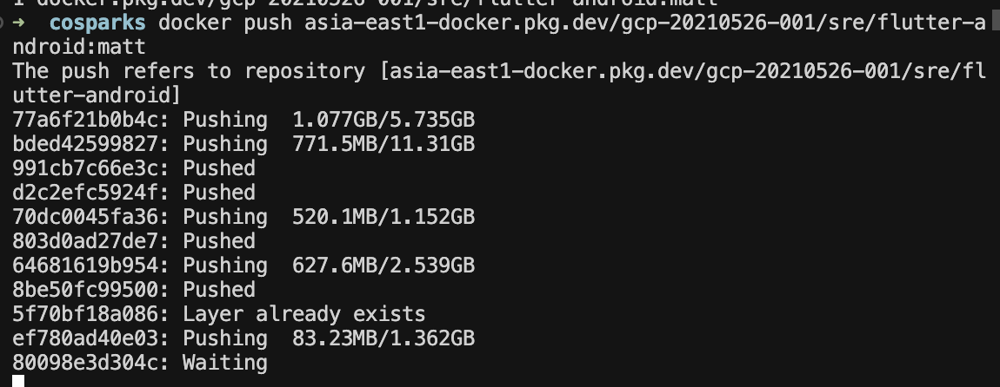
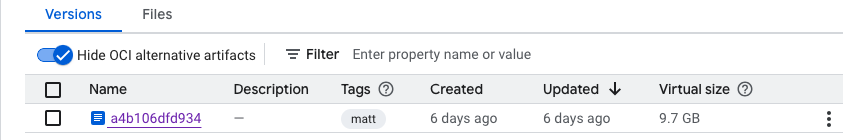

## TL;DR
- CI/CD pipeline 優化案例：加速 build 流程  
- 針對 **image pull** 與 **build-script** 兩大耗時點進行分析與改善  

---

## 背景
公司內部使用自建 CI/CD runner。  
某服務的 pipeline **build 階段需超過 30 分鐘** 才能完成。  

分析發現主要瓶頸來自：  
1. **image pull**  
2. **build-script**  

  
  

---

## Pull Image 優化
該服務原本使用 GitHub Container Registry (ghcr)，受到 **rate limit 限制**，導致拉取時間過長。  

👉 解法：  
- 先將 image 手動拉下來。  
- 再推送到 **與 runner 同 GCP Project 的 GAR (Google Artifact Registry)**。  

在 push 過程中發現：  
- 許多 layer 重複。  
- image size 從 **23GB 減少到不足 10GB**。  

  
  

調整後成果：  
- **image pull 僅需 3 分鐘**。  

  

---

## Build-Script 優化 (尚未實測)
由於任務有花費限制，暫時無法測試針對 `build-script` 加入 **cache** 的加速方案。  

---

## 備註：Image 維護問題
使用 `docker history` 檢查，發現該 image **並非透過 Dockerfile 管理**，而是用 bash script 疊加生成：  

```bash
IMAGE          CREATED         CREATED BY                                      SIZE      COMMENT
5d588bd86c57   5 weeks ago     bash                                            5.74GB    
<missing>      6 weeks ago     /bin/bash                                       11.3GB    
<missing>      6 weeks ago     /bin/bash                                       1.35kB    
<missing>      7 weeks ago     bash                                            202B      
<missing>      7 weeks ago     bash                                            1.15GB    
<missing>      7 weeks ago     bash                                            135MB     
<missing>      12 months ago   RUN |2 flutter_ver=3.22.2 build_rev=0 /bin/s…   2.54GB    buildkit.dockerfile.v0
<missing>      12 months ago   ENV FLUTTER_HOME=/usr/local/flutter FLUTTER_…   0B        buildkit.dockerfile.v0
<missing>      12 months ago   ARG build_rev=0                                 0B        buildkit.dockerfile.v0
<missing>      12 months ago   ARG flutter_ver=3.22.2                          0B        buildkit.dockerfile.v0
<missing>      13 months ago   RUN /bin/sh -c yes | sdkmanager     "platfor…   259MB     buildkit.dockerfile.v0
<missing>      13 months ago   ENV ANDROID_BUILD_TOOLS_VERSION=34.0.0          0B        buildkit.dockerfile.v0
<missing>      13 months ago   ENV ANDROID_PLATFORM_VERSION=34                 0B        buildkit.dockerfile.v0
<missing>      13 months ago   RUN /bin/sh -c if [ $(uname -m) == "x86_64" …   0B        buildkit.dockerfile.v0
<missing>      13 months ago   RUN /bin/sh -c set -o xtrace     && cd /opt …   1.36GB    buildkit.dockerfile.v0
<missing>      13 months ago   ENV ANDROID_SDK_TOOLS_VERSION=10406996          0B        buildkit.dockerfile.v0
<missing>      13 months ago   ENV ANDROID_SDK_ROOT=/opt/android-sdk-linux …   0B        buildkit.dockerfile.v0
<missing>      13 months ago   ENV ANDROID_HOME=/opt/android-sdk-linux LANG…   0B        buildkit.dockerfile.v0
<missing>      13 months ago   USER root                                       0B        buildkit.dockerfile.v0
<missing>      13 months ago   LABEL org.opencontainers.image.source=https:…   0B        buildkit.dockerfile.v0
<missing>      13 months ago   /bin/sh -c #(nop)  CMD ["/bin/bash"]            0B        
<missing>      13 months ago   /bin/sh -c #(nop) ADD file:ac9d5a9d5b9b1217a…   76.2MB    
<missing>      13 months ago   /bin/sh -c #(nop)  LABEL org.opencontainers.…   0B        
<missing>      13 months ago   /bin/sh -c #(nop)  LABEL org.opencontainers.…   0B        
<missing>      13 months ago   /bin/sh -c #(nop)  ARG LAUNCHPAD_BUILD_ARCH     0B        
<missing>      13 months ago   /bin/sh -c #(nop)  ARG RELEASE                  0B        
```

👉 問題：
- 無 Dockerfile 版本控管。
- 後續維護與優化困難。

---

📌 關鍵字：CI/CD Pipeline、DevOps、Container Registry、GAR、Docker Image 優化、Build Cache、Pipeline 加速
