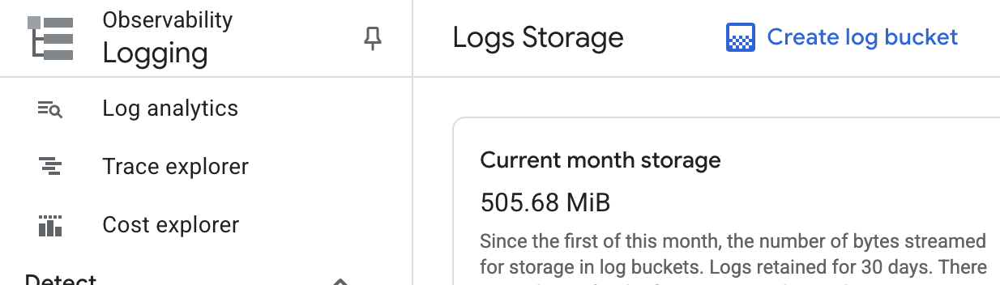
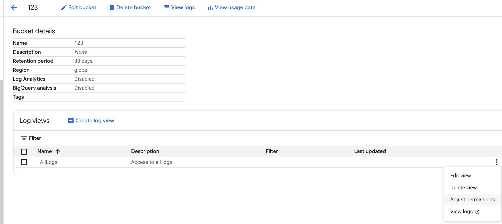
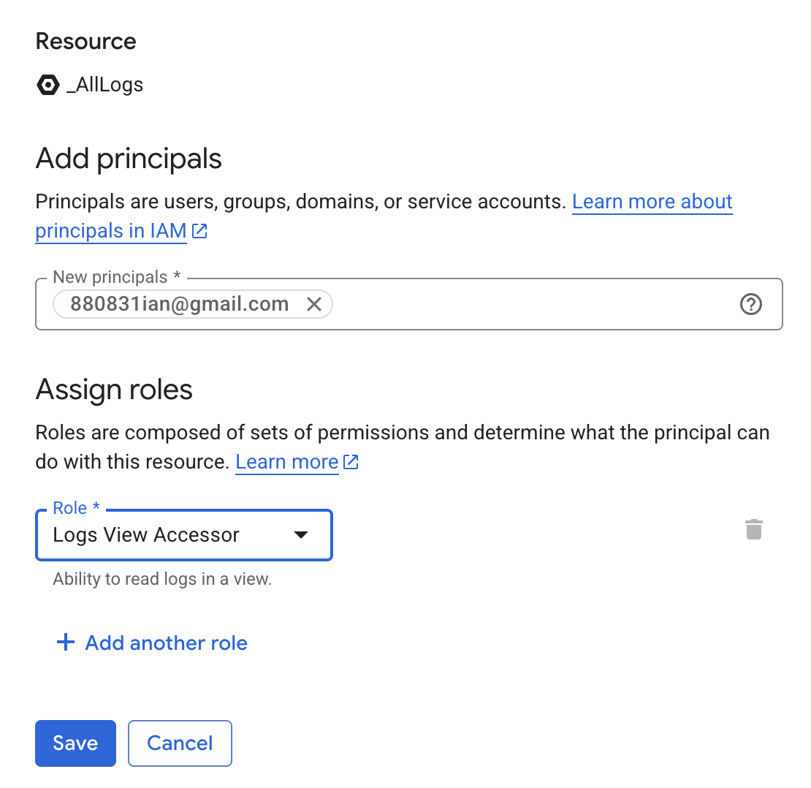

## TL;DR
想要限制不同使用者能讀取的 Log，可以透過 Logging Bucket 進行拆分與授權，讓特定使用者僅能看到指定的 Log。

## 背景
在 Google Cloud Logging 中，主要有兩個重要元件：
- Log Bucket：用來儲存日誌的儲存桶。
- Sink：用來決定哪些 Log 會被寫入到哪個 Log Bucket。

權限控管主要有兩個層級：
1. IAM（專案或資料夾層級）
    - IAM 權限會套用到該專案下的所有 Log Bucket。
    - 這樣的控管較粗糙，無法針對特定 Bucket 做細部授權。
2. Log Bucket 層級
    - 可以直接針對某個 Bucket 設定存取權限。
    - 適合需要精準限制使用者僅能看到部分 Log 的情境。

## 如何針對 Log Bucket 授權
1. 建立 Log Bucket
先在 Cloud Logging 中建立一個新的 Log Bucket。

2. 進入 Log Bucket 設定
在 Bucket 中找到 _AllLogs，點擊 Adjust permissions。

3. 新增使用者並賦予權限
在 Add principal 中加入使用者，並授予 logging.viewAccessor 權限。

完成後，該使用者就能僅存取這個 Log Bucket 的內容，而不會看到其他 Bucket 的資料。

## Sink 的角色
授權決定「誰能讀取哪個 Bucket」後，還需要透過 Sink 來控制「哪些 Log 會被寫入哪個 Bucket」。

例如：
- Dev 環境的 Log → Dev Log Bucket
- Prod 環境的 Log → Prod Log Bucket

透過這樣的拆分，可以做到：
- RD 只能讀取 Dev Log
- SRE 或 Ops 可以讀取 Prod Log

## 總結
如果需要在 Cloud Logging 中進行更細緻的權限控管：
- 使用 Log Bucket 來分隔不同環境或用途的日誌。
- 透過 Bucket 層級的 IAM 權限 指定哪些使用者可以存取該 Bucket。
- 搭配 Sink 決定 Log 的流向。

這樣即可兼顧安全性與可維護性，避免所有人都能讀取所有 Log。

特別感謝 Ian 在討論過程中的協助與測試，讓本文能更完整地呈現 Cloud Logging 權限控管與 Log Bucket 實務操作。
更多相關技術分享可參考他的部落格 👉 [pin-yi.me](https://pin-yi.me/)
