## TL;DR
- Datadog 在蒐集 eck-stack metrics 的坑
- 一些運維紀錄
- [Datadog ElasticSearch Integration](https://docs.datadoghq.com/integrations/elasticsearch/?tab=host#data-collected)
- [Elasticsearch Metrics](https://www.elastic.co/docs/api/doc/elasticsearch/operation/operation-nodes-stats)

## 背景
公司 RD 使用 eck-stack 作為某個功能服務的 DB
因此除了服務的架設，同研究了一下 ES 這個服務，該怎麼監控比較好
❗ 另外需要特別注意的是 eck-stack 是一套 `Operator-base` 的工具
❗ 使用上，可能需要評估是否有足夠的運維技術量能


### [Architecture](https://www.elastic.co/docs/deploy-manage/distributed-architecture/clusters-nodes-shards/node-roles)
eck-stack 的 cluster 在 node 分成不同功能，分別是
- Master(`master`): 會選出 Leader 來管理 cluster
- Data: 包含 (`data`, `data_content`, `data_hot`, `data_warm`, `data_cold`, `data_frozen`) 提供不同功能的資料儲存
- Ingest(`ingest`): 用於資料 pipeline 的處理
- Remote_cluster_client(`remote_cluster_client`): 似乎可以用於橋接不同 eck-cluster
- Machine learning(`ml`): 主要用於 ML
- Transform node (`transform`): 對現有的 indices data 做資料轉換

### 服務監控
基於對 `ElasticSearch` 的了解 `Java base`, `Query & Response`
在 Metrics 的蒐集規劃上，應該會需要針對 `JVM`, `Query Latency` 來評估目前的服務性能與狀態

✅ CPU/JVM
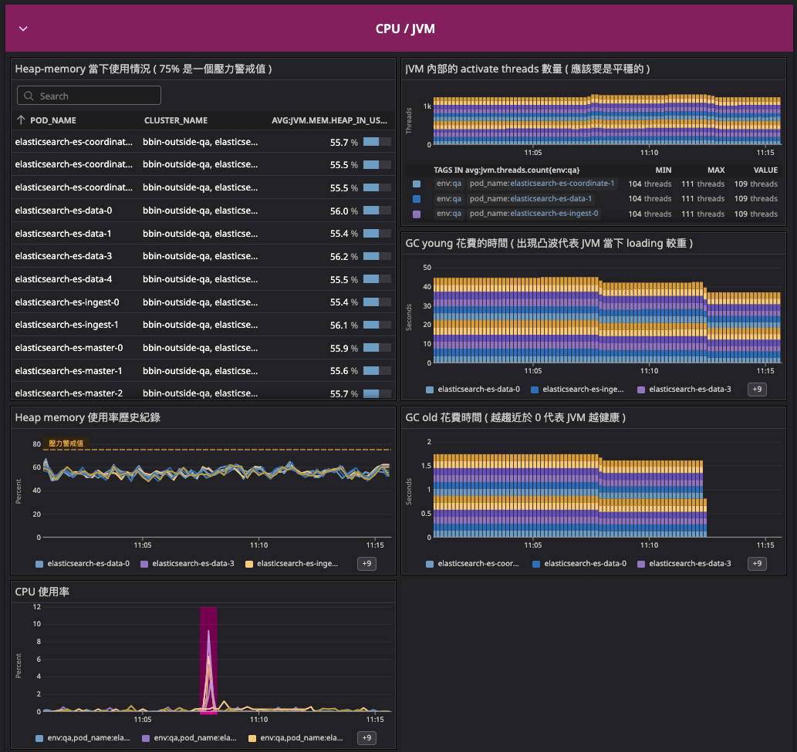
|Name|Metrics|Description|monitoring point|
|-|-|-|-|
|Heap Memory|jvm.mem.heap_in_use| JVM 監控重點|
|CPU usage|elasticsearch.process.cpu.percent|ECK 本身暴露的 CPU metrics|
|thread count|jvm.threads.count|ES 內當前的 thread 數量|
|GC young|jvm.gc.collectors.young.collection_time|JVM 的 young GC|越平穩越好|
|GC old|jvm.gc.collectors.old.collection_time|JVM 的 young GC|應該趨近於 0|

✅ APM
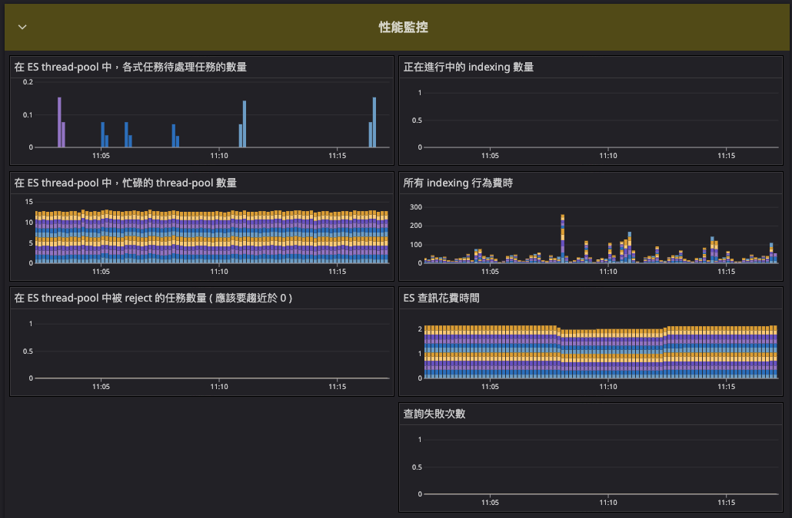
|Name|Metrics|Description|monitoring point|
|-|-|-|-|
|task queue|elasticsearch.thread_pool.*.queue| ES 各式任務 queue 狀態||
|task active|elasticsearch.thread_pool.*.active| ES 運作的 thread||
|task reject|elasticsearch.thread_pool.*.rejected| ES 被拒絕的任務數量||
|query time|elasticsearch.search.query.time|ES 在 query 花費的時間||
|breaker tripped|elasticsearch.breakers.fielddata.tripped|查詢失敗次數||
|indexing current|elasticsearch.indexing.index.current|正在處理的 index 數量||
|indexing time count|elasticsearch.indexing.index.time.count|indexing 費時||

✅ Cluster Info
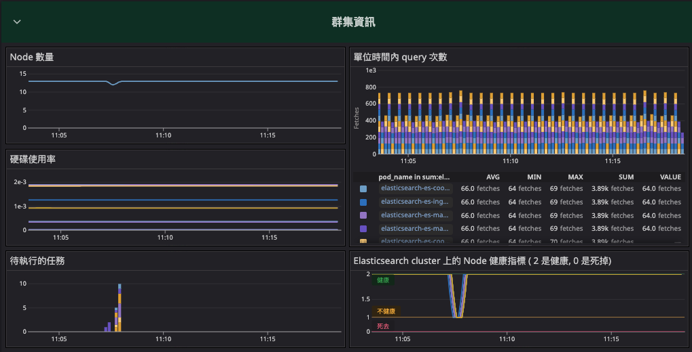
|Name|Metrics|Description|monitoring point|
|-|-|-|-|
|Node count|elasticsearch.number_of_nodes|ES Cluster Node 數量||
|(a)硬碟已使用空間|kubernetes.kubelet.volume.stats.used_bytes||||
|(b)硬碟可用空間|kubernetes.kubelet.volume.stats.capacity_bytes||||
|硬碟使用率| (a) / (b) |透過 Func 計算取得||
|task pending|elasticsearch.pending_tasks_total|待執行的任務||
|search count|elasticsearch.search.fetch.total.count|單位時間內 search 次數||
|Node 狀態|elasticsearch.cluster_status||||

### 服務運維
#### ❗ hot-spot
畢竟資料是以 index 配合 sharding 的方式儲存
會需要額外留心，有機會出現 `資料熱點` 造成的單一 Data-node 壓力

#### ❗ JVM config
在做資源調整時候，有注意到調整 Master Node 的 JVM config
也會連帶影響其他 Node 的 JVM 使用率

#### ❗ 資料
👉 Disk-Resize [reference-link](https://discuss.elastic.co/t/resize-disk-of-a-stateful-set/219758)
eck-stack 的 ElasticSearch Cluster 如果要 resize 硬碟大小需要
1. 設置對應 node 群集的硬碟資源
2. 重新對該 node 群集命名

為了確保儲存的資料正常，可以到 `Kibana` >> `Stack Management` >> `Index Management` 來看當下資料的 Indices 情況
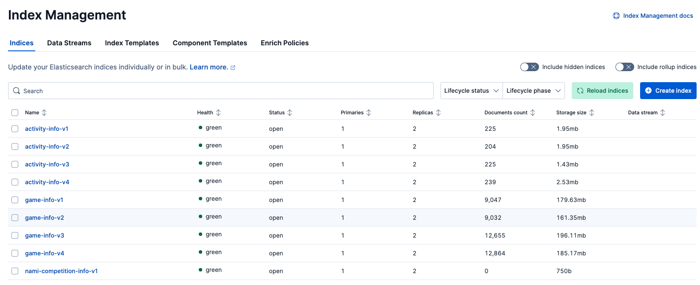
對 data node 硬碟 resize
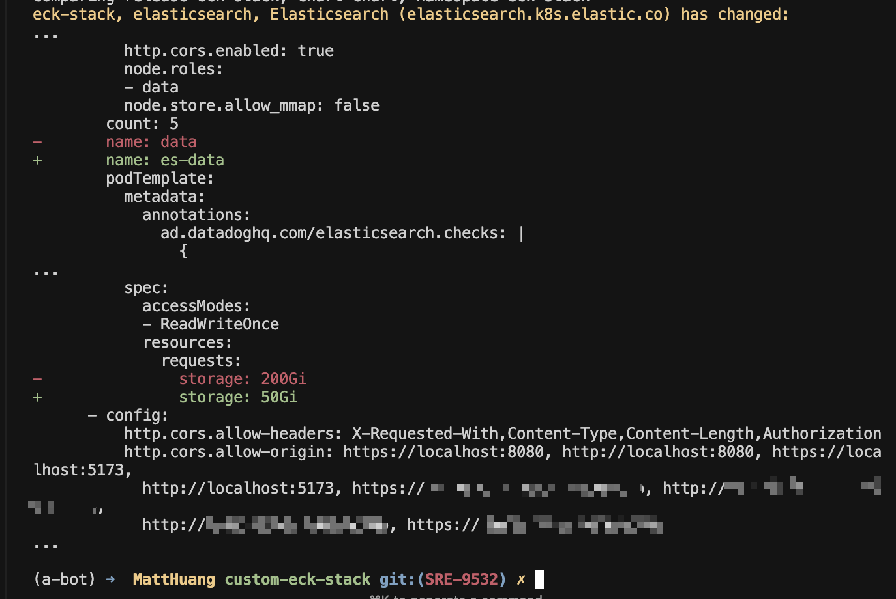
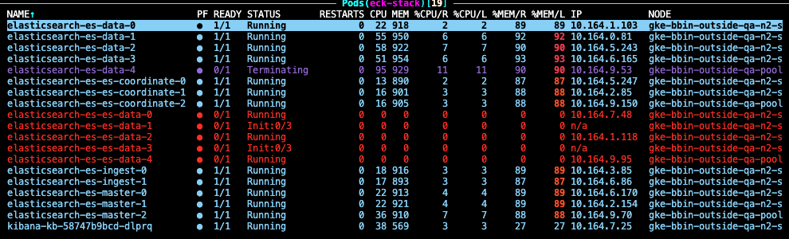
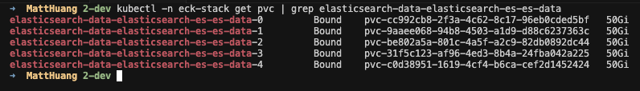
從監控可以看到使用率確實提升
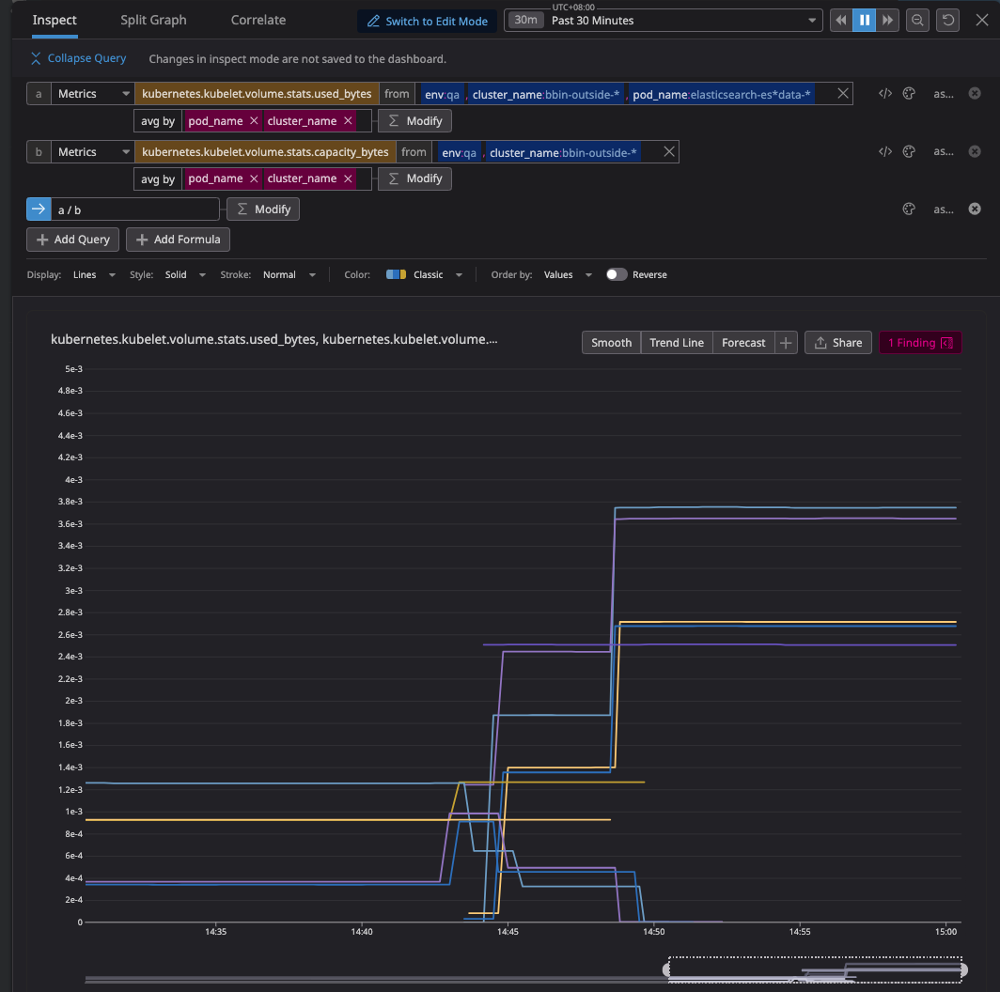
Indices 狀態也都是健康的
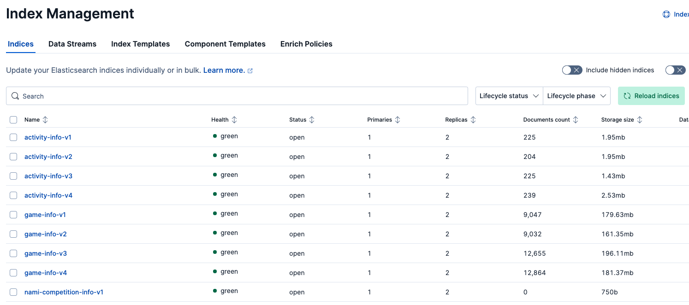


## ❓ 踩坑與問題排查

### 使用 Datadog integration 來蒐集 metrics 卻發現在 Dashboard 找不到？
`ElasticSearch` expose 出來的 metrics 中包含了 `cluster_name` 這個 tag
並賦予 `elasticsearch` 這個值，碰巧撞名了

對此， Datadog [intergration-core](https://github.com/DataDog/integrations-core/blob/master/elastic/datadog_checks/elastic/data/conf.yaml.example#L135) 有提到相關說明
但實測結果為 `metrics` 全部消失
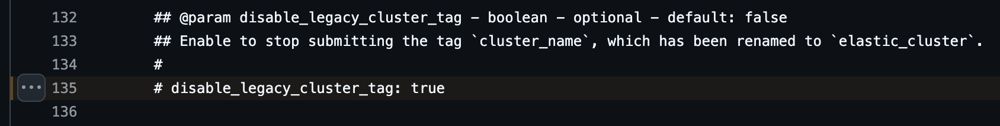

因此暫時額外打上 `cluster_name` 的 tag 使其可以被搜尋
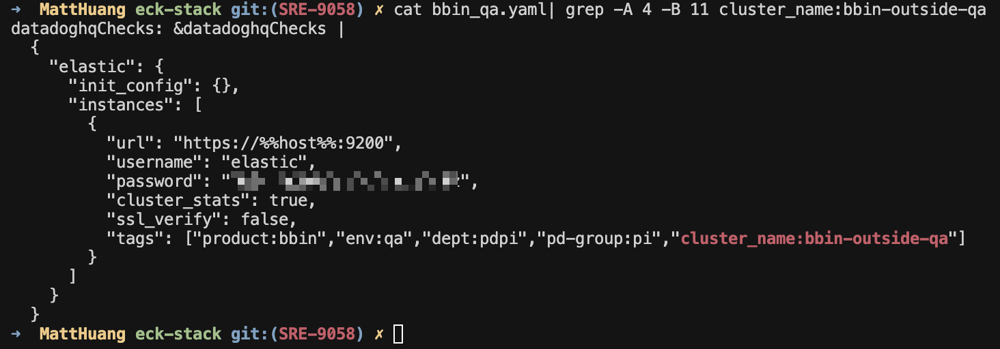


## 排查過程紀錄
單純的一些 log，保留紀錄部分查詢資料與當時測試的手法
實際問題，已與下列無關

- [Datadog ElasticSearch Integration](https://docs.datadoghq.com/integrations/elasticsearch/?tab=host#data-collected)
- [Elasticsearch Metrics](https://www.elastic.co/docs/api/doc/elasticsearch/operation/operation-nodes-stats)

```
 curl -k -u elastic:xxx https://elasticsearch-es-http.eck-stack.svc:9200/_nodes/stats/jvm,os,indices
```
Elasticsearch 的底層是用 Java 建構
故還是會有 JVM Heap_memory 等相關問題
故，在 monitoring 上主觀認為下列 metrics 是必要的
1. fetch.total
2. jvm
3. latency

由 fetch.total 可以知道當下 query 的需求量
同步確認 jvm 的 heap_memory 對於 query 的變化
並觀察 query 是否有產生 latency
來確認服務運行的情況

### 首先

一開始進到服務下 `agent check elastic` 找不到相關 metrics
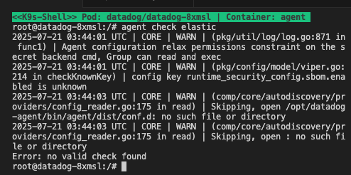)
從圖中提到
```
Skipping, open /opt/datadog-agent/bin/agent/dist/conf.d: no such file or directory
```

故，先確認是否可以從 elasticsearch 服務取得 metrics

由於服務已加上 datadoghq.checks 的 annotatino 之後，還是無法收到完整的 metrics
後續找到可以在 datadog-agent 上設置相關 config
[agent-config 參考](https://github.com/DataDog/helm-charts/blob/main/charts/datadog/README.md#confd-and-checksd)
```
datadog:
  confd:
    redisdb.yaml: |-
      ad_identifiers:
        - redis
        - bitnami/redis
      init_config:
      instances:
        - host: "%%host%%"
          port: "%%port%%"
    jmx.yaml: |-
      ad_identifiers:
        - openjdk
      instance_config:
      instances:
        - host: "%%host%%"
          port: "%%port_0%%"
    redisdb.yaml: |-
      init_config:
      instances:
        - host: "outside-k8s.example.com"
          port: 6379
```

故嘗試在對應的 datadog 加上
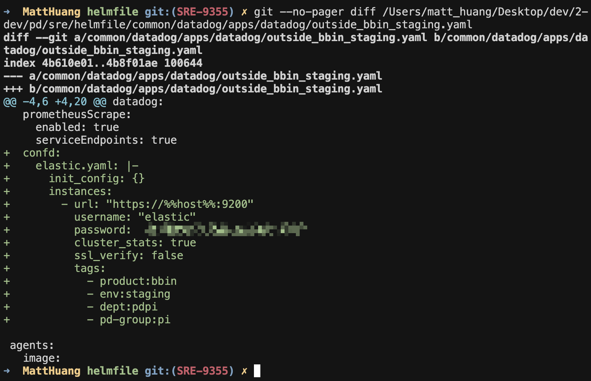
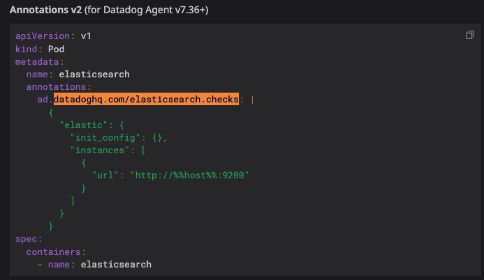

相關 eck-stack 的 metrics 取得 [參考](https://www.elastic.co/docs/api/doc/elasticsearch/operation/operation-nodes-stats?utm_source=chatgpt.com)
