## TL;DR
- log system 評估及運維研究

## 背景與挑戰
公司現有的主要監控系統 `Datadog` 會去收集服務 `stdout` 的 Log
部分服務收的 Log 有其重要性，卻會因為 `Datadog` 硬限制導致 Log 被截斷，且暫時無法處理
故，協助評估維持 `stdout` 情跨下的 Log 收集及儲存

### 內容
- 選擇
- Sidecar
- Daemonset-Agent

### 比較與選擇
|       |Sidecar         |Daemonset Agent     |
|-------|----------------|--------------------|
|耦合度  |高，與 Pod 綁定   |低，與應用端完全解耦    |
|資源效率|每個 Pod 有額外開銷|每台 Node 僅一個 Agent|
|故障衝擊|小，指影響 Pod    |大，整個 Node         |

Sidecar 考慮公司 Tech-stack 選擇熟悉的 `Fluent-bit`
Daemonset Agent 則是選擇 Datadog 用 Rust 開發的 `Vector`，來多一個選擇可以參考

### Sidecar
> ### 方案一
> 
> ### 服務 log 寫入指定路徑與 fluent-bit 共享( 需改 code )
> 透過 `Fluent-bit` Sidecar 的方式收集 log 在集中送到 `Fluent Server` 後，轉送到 `OpenSearch`
> 👉 問題
> 過去遇到過 `Fluent Server` 或 `OpenSearch` 遇到 IOPS 壓力導致堆積
> 會讓 `Fluent-bit` log 持續堆積而重啟，最後有可能導致 Pod 連帶被判定有問題而死掉
> 👉 方案
> 排除堆積問題點後，讓服務 Pod 重啟即可
> 後續也注意到 `fluent-server` 有對應的機制與設定，可以避免 OOM crash
> 
> ### 方案二
> 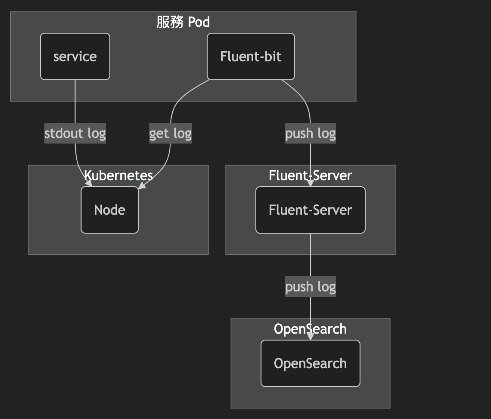
> ### fluent-bit 直接到 Node 撈取服務 stdout 的 log
> 👉 問題
> 當類似需求的服務數量多了之後，會有過多重複性的 process 做著同樣的事情
> 👉 方案
> 透過 `Daemonset Agent` 的方式，減少相關議題

#### 實作

👉 fluentBit Sidecar 設置
> 請忽略 TAR 的設置
> varlog-host-path 是取 `K8s-node-log`
> fluent-bit-db 是在 Pod 內建立一個 Pod 級別生命週期的 DB 來記錄 Node-log 讀取到哪，故不會隨著 container restart 而消失，但會隨著 Pod destroy & restart 而重置
> 
> 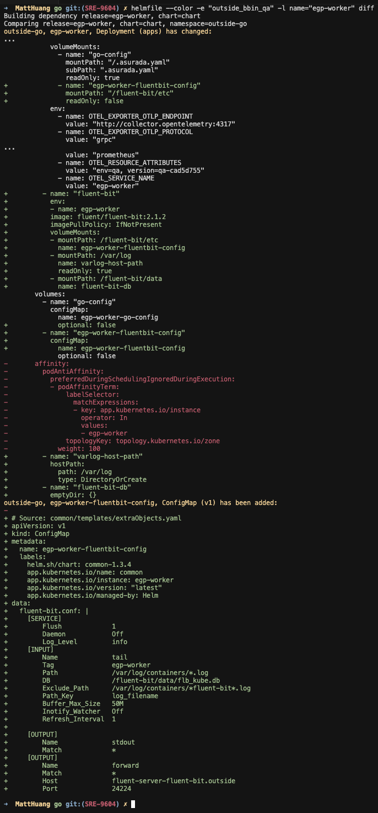

👉 fluent-server config
> 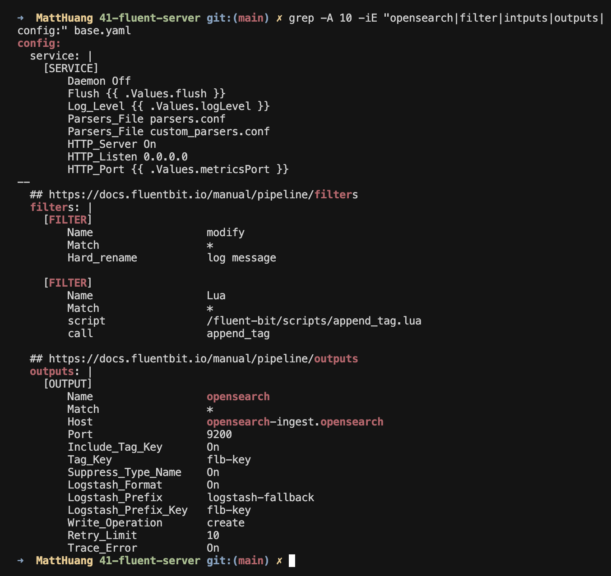

👉 Log 重複發送
> 由於是 Sidecar，所以如果服務處在同一個 Node 確實會有重複發送的問題
> 這邊新增 POD_NAME 的環境變數，來做 filter
> 
> 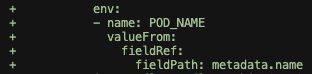
> 
> 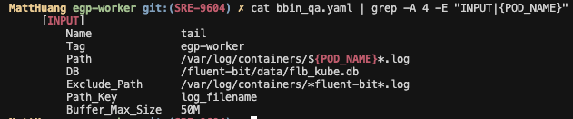

👉 針對背壓處理 [官方說明連結](https://docs.fluentbit.io/manual/2.1/administration/backpressure)
> Fluent-bit 提供兩種 Buffer 方式來應對背壓
> 
> 官方說明 只需要 storage.type memory 配合 Mem_Buf_Limit，應該就可以觸發 log 收集的 pause & resume
> 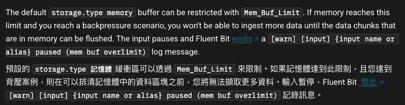
> 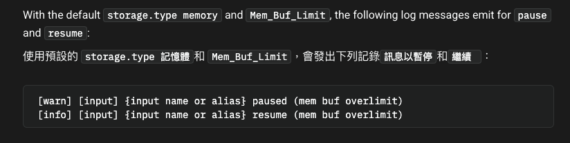
> 只是由於上述的 Log 還是存在 Memory, 故會有 OOM 導致 Log 遺失的風險
> 故可以讓 log 寫入 file 做類持久化保存，待送出後清空
> 需要注意的是 `storage.type filesystem` 會讓 `Mem_buf_Limit` 失效，取而代之的是 [storage.max_chunks_up](https://docs.fluentbit.io/manual/2.1/administration/buffering-and-storage#:~:text=Off-,storage.max_chunks_up,-If%20the%20input)
> 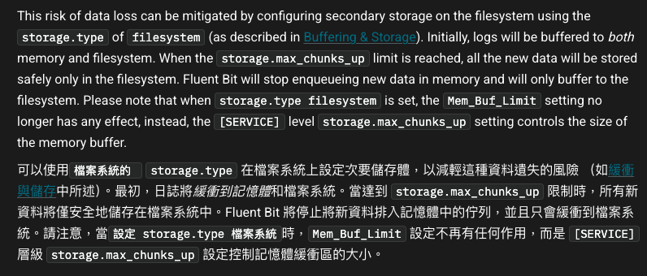
> 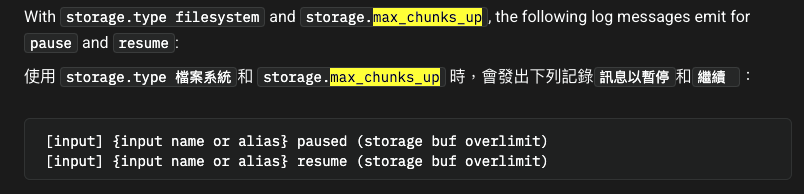
> 透過 `storage.type filesystem` & `storage.max_chunks_up` 來處理背壓
> 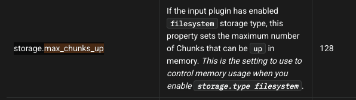
> 最後的結果
> 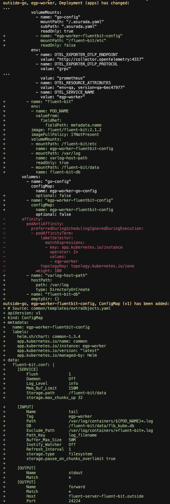


### Daemonset - Agent
> 透過與 Datadog-Agent 相似的架構，直接到 Node 指定位置撈 log 後把 log 轉發指定 endpoint
> 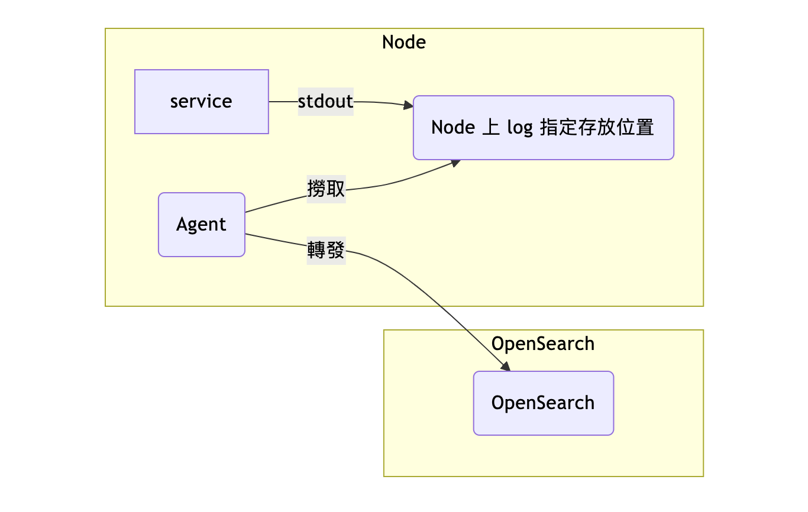
> 這個方式讓 log system 與服務解耦，可以個別獨立的運行
> 原則上是比較好的方案，但由於 Daemonset 機制會在每一顆 Node 運行一個 `Agent` 服務
> 會有資源運用考量

#### 實作

👉 Vector Daemonset Agent 設置
> - Vector
> - Fluent-bit
> 
> Fluent-bit 是熟悉的工具，也相當成熟
> Vector 則是除了 logs 以外，還可以 metrics 蒐集 👉 [參考](https://vector.dev/docs/reference/configuration/sources/prometheus_scrape/)
> 但在 data pipeline 的部分，會需要去熟悉 [VRL](https://vector.dev/docs/reference/configuration/transforms/remap/) 的語法
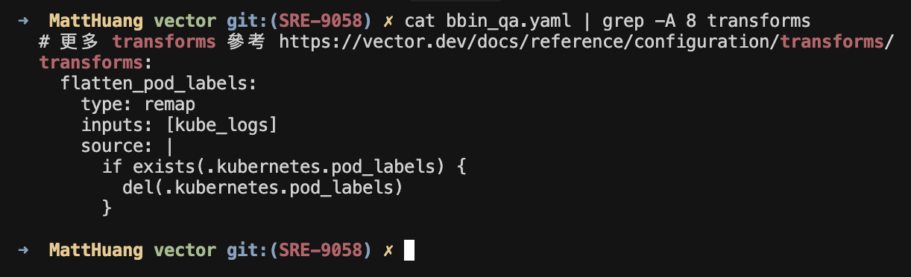
[VRL Playground](https://playground.vrl.dev/)
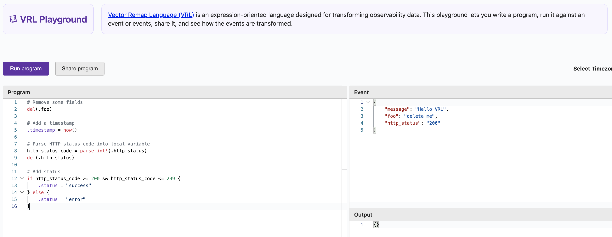
> 
> 這邊是測試時用 Vector 的 Daemonset-Agent mode 來收集 log 並送到 OpenSearch 的設置
> ```yaml
> # 更多 customConfig 參考 https://vector.dev/docs/reference/configuration/
> customConfig:
>   data_dir: /vector-data-dir
> 
>   # expose api for health-check
>   api:
>     enabled: true
>     address: 127.0.0.1:8686
>     playground: false
>   
>   # 更多 sources 參考 https://vector.dev/docs/reference/configuration/sources/
>   sources:
>     kube_logs:
>       type: kubernetes_logs
>       auto_partial_merge: true
>       max_line_bytes: 52428800
>       max_merged_line_bytes: 104857600
>     es_metrics:
>       type: prometheus_scrape
>       auth:
>         strategy: "basic"
>         user: "elastic"
>         password: "2rxxxxxxxxxxxxxxxxxxxx0z"
>       endpoints:
>         - https://elasticsearch-es-coordinate.eck-stack:9200/_nodes/stats/jvm,os,indices
>       tls:
>         verify_certificate: false
>   
>   # 更多 transforms 參考 https://vector.dev/docs/reference/configuration/transforms/
>   transforms:
>     flatten_pod_labels:
>       type: remap
>       inputs: [kube_logs]
>       source: |
>         if exists(.kubernetes.pod_labels) {
>           del(.kubernetes.pod_labels)
>         }
>     es_metrics_op:
>       type: remap
>       inputs:
>         - es_metrics
>       source: |
>         .tags.product = "bbin"
>         .tags.env = "qa"
>         .tags.dept = "pdpi"
>         .tags.pd_group = "pi"
>         .tags.resource = "vector"
>
>   # Vector 中 OpenSearch 的 sinks 與 elasticsearch 是一樣的
>   # 更多 sinks 參考 https://vector.dev/docs/reference/configuration/sinks/
>   sinks:
>     opensearch:
>       api_version: v8
>       type: elasticsearch
>       inputs:
>         - flatten_pod_labels
>       endpoints:
>         - "http://opensearch-ingest.opensearch.svc.cluster.local:9200"
>       tls:
>         verify_certificate: false
>     
>     # datadog_metrics:
>     #   type: datadog_metrics
>     #   inputs:
>     #     - es_metrics_op
>     #   default_api_key: "69xxxxxxxxxxxxxxxxxxxxxxxxxxxxd6"
>     #   tls:
>     #     verify_certificate: false
> 
>     console:
>       type: console
>       inputs:
>         - es_metrics
>       encoding:
>         codec: "text"
> 
> 
> service:
>   enabled: true
>   ports:
>     - name: prom-exporter
>       port: 9090
>       protocol: TCP
>       targetPort: 9090
> ```

### OpenSearch Dashboard 設置

> Discover 要可以看對應 index 的 log
> 會需要先設置來源 index
> 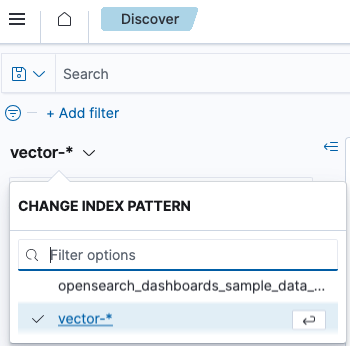
> `Stack Management` >> `Index patterns`
> 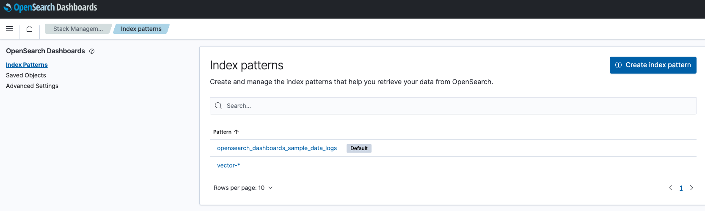
> 完成設置後就可以看到 [傳送門](https://opensearch.out.in.qa.rdapp.vip/app/discover#/?_g=(filters:!(),query:(language:kuery,query:''),refreshInterval:(pause:!f,value:900000),time:(from:now-3d,to:now))&_a=(columns:!(_source),filters:!(),index:egp,interval:auto,query:(language:kuery,query:''),sort:!()))
> 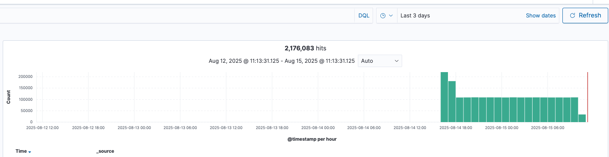
> 