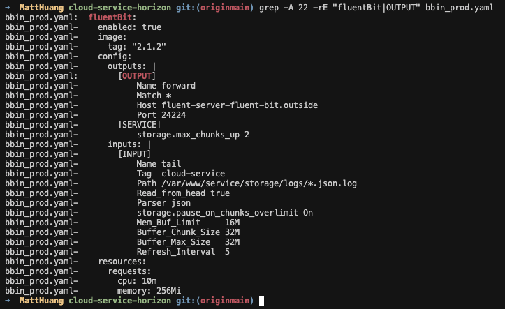
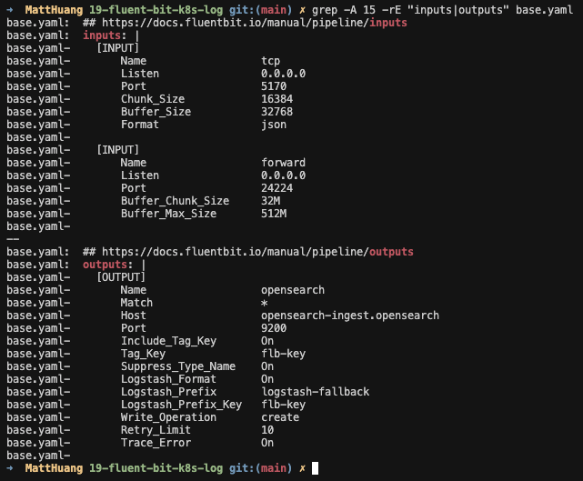
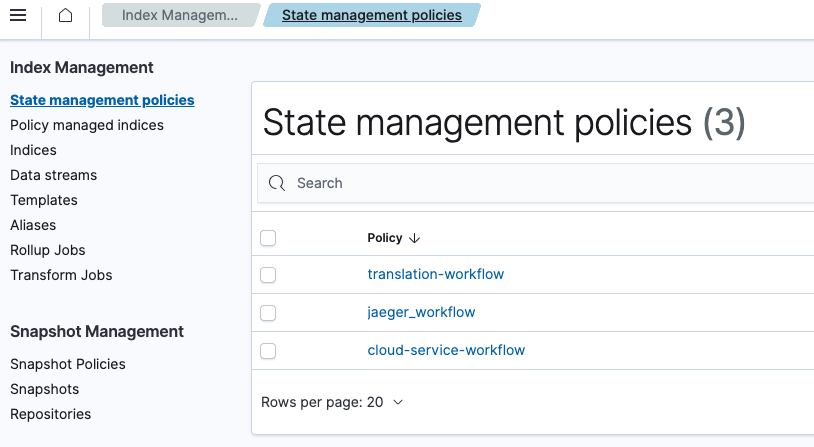

## TL;DR
透過 fluentbit 將服務 log 送到 OpenSearch

## 背景
公司 RD 發單詢問，想確認相關服務的 log 收集方式以及細節
正巧用這個機會，也讓自己多了解一下不同的 log 收集方式

## Logging
在 GKE 用非侵入式的方式來收集 log 大概有兩種
- Side Car：服務 Pod 外掛除了服務 container 以外，另一個專門收集 log 的 container
- Daemonset Agent：服務透過 stdout 把 log 送到所在 Node，透過 Agent 收集

### Fluent-bit
是一個相當成熟的 logging tool，由於底層是 C，故 `輕量` 與 `效能優異` ，使得他被廣泛使用 ([參考](https://docs.fluentbit.io/manual/about/fluentd-and-fluent-bit))
在他的 Key [concepts](https://docs.fluentbit.io/manual/concepts/key-concepts) 可以看到，他著重在 `Event or Record`, `Data Pipeline`
同時也支援 `Buffering`，這對於 logging peak 有巨量差異的使用情況，或許能做到一部份的緩解

### Side-Car X Fluent-bit

以 Side Car 的方式來收集 log，那一個 Pod 內至少會有兩個 container 分別是負責業務的 `service` 以及 log 收集的 `fluent-bit`

接著我們透過 `fluent-bit` 把 log 集中送到 `fluent-server` (如下 `[OUTPUT]` 的部分)

接續可以在 `fluent-server` 看到有設置對應的 input 以及 log 輸出的目的

在這邊就可以最後是送往 `OpenSearch`

到這邊，就可以在 OpenSearch 的 `Index Management` >> `Indices` 去看到名為 `cloud-service-*` 的 log index


## OpenSearch

### logging index management
在 OpenSearch 除了可以收集 log，也能對 log 做 `data pipeline` 的處理
在 `Index Management` >> `State management policies` 建立相關的 Policy 來管理對應的 logging-index

這邊是相關的 Policy setup
這邊的 Policy 是設置 Index 最多保留 3 天，超過保留期限的會刪除

`policy.default_state`：log 收進來後的預設該進到哪個狀態
`policy.states`：這個 policy 有的狀態類別，其中以 Json 表示一個狀態
`policy.states[n].actions`：log 收進來後的管理行為
`policy.states[n].transitions`：對 log 後續的管理行為
`policy.states[n].delete`：對 log 進行刪除不保留

```json
{
    "id": "cloud-service-workflow",
    "policy": {
        "policy_id": "cloud-service-workflow",
        "description": "cloud-service workflow",
        "default_state": "hot",
        "states": [
            {
                "name": "hot",
                "actions": [
                    {
                        "retry": {
                            "count": 3,
                            "backoff": "exponential",
                            "delay": "1m"
                        },
                        "allocation": {
                            "require": {
                                "temp": "hot"
                            },
                            "include": {},
                            "exclude": {},
                            "wait_for": false
                        }
                    },
                    {
                        "retry": {
                            "count": 3,
                            "backoff": "exponential",
                            "delay": "1m"
                        }
                    }
                ],
                "transitions": [
                    {
                        "state_name": "delete",
                        "conditions": {
                            "min_index_age": "3d"
                        }
                    }
                ]
            },
            {
                "name": "delete",
                "actions": [
                    {
                        "retry": {
                            "count": 3,
                            "backoff": "exponential",
                            "delay": "1m"
                        },
                        "delete": {}
                    }
                ],
                "transitions": []
            }
        ],
        "ism_template": [
            {
                "index_patterns": [
                    "cloud-service-*"
                ],
                "priority": 1,
                "last_updated_time": 1715236465402
            }
        ]
    }
}
```

