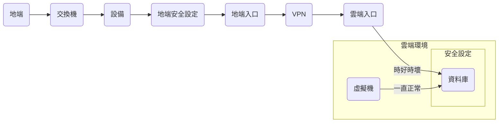

## TL;DR
- 刻意練習，從「解決問題」到「看到問題的全貌」

### 你是否也是個「很會解決問題」的人？

當接收到問題的第一時間你開始
- 猜測這個問題的原因
- 立刻 Google 或問 AI:「我遇到 xxx 的狀況，可能因素？我可以怎麼解決？」

如果找到原因，那很幸運
如果找不到原因，你要怎麼在 Call-Out 的時候「精準的」描述你的問題呢？

### 避免「過於專注」在問題本身

在接收到問題的第一時間
有沒有可能我們不要「過於專注」在問題本身？
嘗試找到「 問題範圍 」、「 問題結構 」再嘗試重新理解這個問題呢？

### 重新看到問題的全貌

身為軟體工程的我，很常接收到類似的提問
「我的地端設備，透過 VPN 連線對雲上的資料庫連線斷斷續續的」

當我專注在思考
是資料庫本身異常，還是網路的問題
而嘗試直接開始解決問題時候，我看到的只有「資料庫、地端設備、VPN」

不過...我們可以嘗試換個角度
請問地端設備連線到雲上資料庫，經過了哪些元件呢？
設備有沒有相關安全性設置？有沒有透過程式控制的邏輯呢？

這個過程就像拼圖一樣，慢慢把所有的資訊補齊
最後我獲得到更完整的「問題全貌」

### 不再只是「很會解決問題」

透過上述更架構性且系統性的理解問題幫助我

- 更精準的找到問題切點
- 能夠在現有的框架中主動發現問題
- 當需要求援的時候，能更精準的描述問題

即使是開迷霧般的大任務也能

- 更明確的知道「我需要什麼」
- 判斷各個小任務的輕重緩急
- 未來的規劃與安排

共勉之
