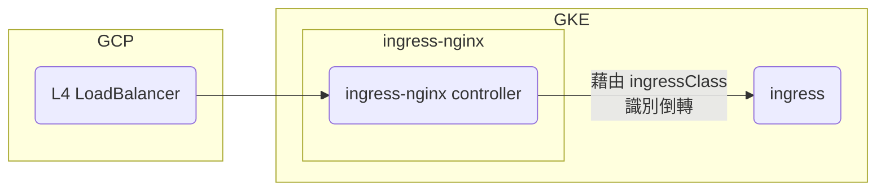
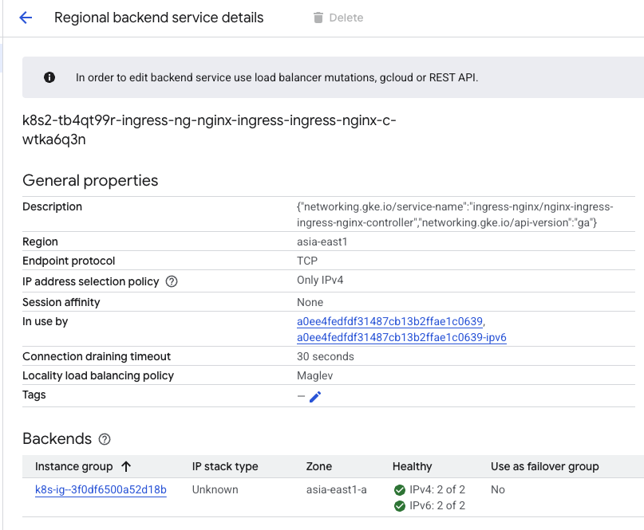
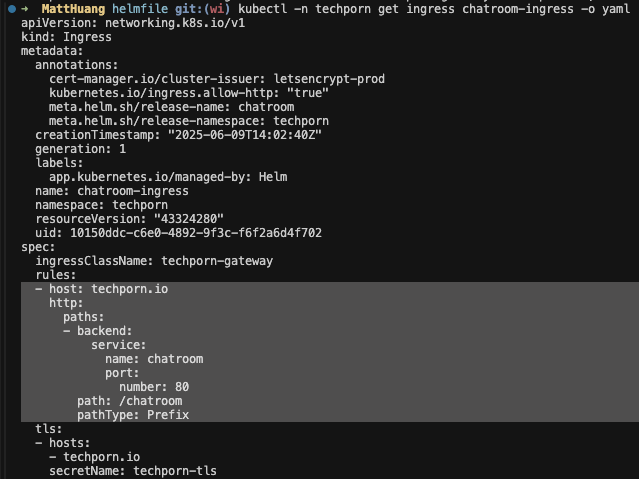
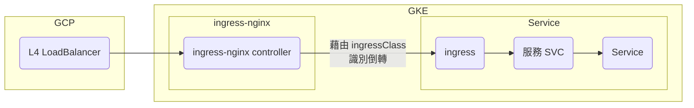
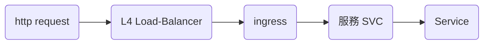

## TL;DR
Techporn 平台在 **GKE (Google Kubernetes Engine)** 上，利用 `ingress-nginx` 控制流量的部署與導流機制。

---

## 背景
我們選擇 GKE 作為主要服務部署平台，並使用 `ingress-nginx` 來進行流量控制與服務導流。

---

## 核心元件：Ingress-Nginx
透過 `Helm` 部署的 ingress-nginx，會建立一個 `ingress-nginx-controller`，負責管理所有 Ingress 資源。  

參考指令:
```sh
➜ helm diff ingress-nginx ingress-nginx/ingress-nginx --namespace ingress-nginx --allow-unreleased
Command "helm diff" is deprecated, use "helm diff upgrade" instead
********************

        Release was not present in Helm.  Diff will show entire contents as new.

********************
ingress-nginx, ingress-nginx, ClusterRole (rbac.authorization.k8s.io) has been added:
- 
+ # Source: ingress-nginx/templates/clusterrole.yaml
+ apiVersion: rbac.authorization.k8s.io/v1
+ kind: ClusterRole
+ metadata:
+   name: ingress-nginx
+   labels:
+   ... 略
ingress-nginx, ingress-nginx, ClusterRoleBinding (rbac.authorization.k8s.io) has been added:
- 
+ # Source: ingress-nginx/templates/clusterrolebinding.yaml
+ apiVersion: rbac.authorization.k8s.io/v1
+ kind: ClusterRoleBinding
+ metadata:
+   name: ingress-nginx
+   ... 略
ingress-nginx, ingress-nginx, Role (rbac.authorization.k8s.io) has been added:
- 
+ # Source: ingress-nginx/templates/controller-role.yaml
+ apiVersion: rbac.authorization.k8s.io/v1
+ kind: Role
+ metadata:
+   name: ingress-nginx
+   namespace: ingress-nginx
+   labels:
+   ... 略
ingress-nginx, ingress-nginx, RoleBinding (rbac.authorization.k8s.io) has been added:
- 
+ # Source: ingress-nginx/templates/controller-rolebinding.yaml
+ apiVersion: rbac.authorization.k8s.io/v1
+ kind: RoleBinding
+ metadata:
+   labels:
+   ... 略
ingress-nginx, ingress-nginx, ServiceAccount (v1) has been added:
- 
+ # Source: ingress-nginx/templates/controller-serviceaccount.yaml
+ apiVersion: v1
+ kind: ServiceAccount
+ metadata:
+   labels:
+   ... 略
ingress-nginx, ingress-nginx-admission, ClusterRole (rbac.authorization.k8s.io) has been added:
- 
+ # Source: ingress-nginx/templates/admission-webhooks/job-patch/clusterrole.yaml
+ apiVersion: rbac.authorization.k8s.io/v1
+ kind: ClusterRole
+ metadata:
+   name: ingress-nginx-admission
+   annotations:
+   ... 略
ingress-nginx, ingress-nginx-admission, ClusterRoleBinding (rbac.authorization.k8s.io) has been added:
- 
+ # Source: ingress-nginx/templates/admission-webhooks/job-patch/clusterrolebinding.yaml
+ apiVersion: rbac.authorization.k8s.io/v1
+ kind: ClusterRoleBinding
+ metadata:
+   name: ingress-nginx-admission
+   annotations:
+   ... 略
ingress-nginx, ingress-nginx-admission, Role (rbac.authorization.k8s.io) has been added:
- 
+ # Source: ingress-nginx/templates/admission-webhooks/job-patch/role.yaml
+ apiVersion: rbac.authorization.k8s.io/v1
+ kind: Role
+ metadata:
+   name: ingress-nginx-admission
+   namespace: ingress-nginx
+   annotations:
+   ... 略
ingress-nginx, ingress-nginx-admission, RoleBinding (rbac.authorization.k8s.io) has been added:
- 
+ # Source: ingress-nginx/templates/admission-webhooks/job-patch/rolebinding.yaml
+ apiVersion: rbac.authorization.k8s.io/v1
+ kind: RoleBinding
+ metadata:
+   name: ingress-nginx-admission
+   namespace: ingress-nginx
+   annotations:
+   ... 略
ingress-nginx, ingress-nginx-admission, ServiceAccount (v1) has been added:
- 
+ # Source: ingress-nginx/templates/admission-webhooks/job-patch/serviceaccount.yaml
+ apiVersion: v1
+ kind: ServiceAccount
+ metadata:
+   name: ingress-nginx-admission
+   namespace: ingress-nginx
+   annotations:
+   ... 略
+   labels:
+   ... 略
+ automountServiceAccountToken: true
ingress-nginx, ingress-nginx-admission, ValidatingWebhookConfiguration (admissionregistration.k8s.io) has been added:
- 
+ # Source: ingress-nginx/templates/admission-webhooks/validating-webhook.yaml
+ # before changing this value, check the required kubernetes version
+ # https://kubernetes.io/docs/reference/access-authn-authz/extensible-admission-controllers/#prerequisites
+ apiVersion: admissionregistration.k8s.io/v1
+ kind: ValidatingWebhookConfiguration
+ metadata:
+   annotations:
+   labels:
+   ... 略
+   name: ingress-nginx-admission
+ webhooks:
+   - name: validate.nginx.ingress.kubernetes.io
+   ... 略
ingress-nginx, ingress-nginx-admission-create, Job (batch) has been added:
- 
+ # Source: ingress-nginx/templates/admission-webhooks/job-patch/job-createSecret.yaml
+ apiVersion: batch/v1
+ kind: Job
+ metadata:
+   name: ingress-nginx-admission-create
+   namespace: ingress-nginx
+   annotations:
+   ... 略
+ spec:
+   ... 略
ingress-nginx, ingress-nginx-admission-patch, Job (batch) has been added:
- 
+ # Source: ingress-nginx/templates/admission-webhooks/job-patch/job-patchWebhook.yaml
+ apiVersion: batch/v1
+ kind: Job
+ metadata:
+   name: ingress-nginx-admission-patch
+   namespace: ingress-nginx
+   annotations:
+   ... 略
+ spec:
+   ... 略
ingress-nginx, ingress-nginx-controller, ConfigMap (v1) has been added:
- 
+ # Source: ingress-nginx/templates/controller-configmap.yaml
+ apiVersion: v1
+ kind: ConfigMap
+ metadata:
+   labels:
+   ... 略
+   name: ingress-nginx-controller
+   namespace: ingress-nginx
+ data:
ingress-nginx, ingress-nginx-controller, Deployment (apps) has been added:
- 
+ # Source: ingress-nginx/templates/controller-deployment.yaml
+ apiVersion: apps/v1
+ kind: Deployment
+ metadata:
+   labels:
+   ... 略
+   name: ingress-nginx-controller
+   namespace: ingress-nginx
+ spec:
+   ... 略
ingress-nginx, ingress-nginx-controller, Service (v1) has been added:
- 
+ # Source: ingress-nginx/templates/controller-service.yaml
+ apiVersion: v1
+ kind: Service
+ metadata:
+   annotations:
+   labels:
+   ... 略
+   name: ingress-nginx-controller
+   namespace: ingress-nginx
+ spec:
+   ... 略
ingress-nginx, ingress-nginx-controller-admission, Service (v1) has been added:
- 
+ # Source: ingress-nginx/templates/controller-service-webhook.yaml
+ apiVersion: v1
+ kind: Service
+ metadata:
+   labels:
+   ... 略
+ spec:
+   ... 略
ingress-nginx, nginx, IngressClass (networking.k8s.io) has been added:
- 
+ # Source: ingress-nginx/templates/controller-ingressclass.yaml
+ apiVersion: networking.k8s.io/v1
+ kind: IngressClass
+ metadata:
+   labels:
+   ... 略
+   name: nginx
+ spec:
+   controller: k8s.io/ingress-nginx
```

同時，GCP 會建立一個 **L4 Load Balancer** 來承接外部流量。 

接著設置 ingressClass
```yaml
apiVersion: networking.k8s.io/v1
kind: Ingress
metadata:
  annotations:
    cert-manager.io/cluster-issuer: letsencrypt-prod
    meta.helm.sh/release-name: docs
    meta.helm.sh/release-namespace: cosparks
    nginx.ingress.kubernetes.io/limit-burst-multiplier: "2"
    nginx.ingress.kubernetes.io/limit-connections: "10"
    nginx.ingress.kubernetes.io/limit-rpm: "600"
    nginx.ingress.kubernetes.io/limit-rps: "10"
    nginx.ingress.kubernetes.io/rewrite-target: /
    nginx.ingress.kubernetes.io/ssl-redirect: "true"
  creationTimestamp: "2025-09-19T10:13:53Z"
  generation: 4
  labels:
    app.kubernetes.io/managed-by: Helm
  name: docs-ingress
  namespace: cosparks
  resourceVersion: "1758279423886847006"
  uid: ea607a0f-948b-4046-97be-1c1c2e320fd3
spec:
  ingressClassName: nginx
  rules:
  - host: docs.cosparks.app
    http:
      paths:
      - backend:
          service:
            name: docs
            port:
              number: 80
        path: /
        pathType: Prefix
```

架構圖如下：  


對應的 `Load Balancer` 設定畫面：  


---

## Ingress 導流配置
接下來，我們會在服務的 `Ingress` 中設定 **path 與對應的 Service (SVC)**，讓 ingress-nginx 知道如何正確導流。  

範例如下：  


加入服務架構圖後：  


因此完整的 request flow 如下：  


---

## DNS 解析
是否需要配置 **DNS**，取決於服務是否綁定 Domain：  
- 若有綁定 Domain → 需設定 DNS 解析至 Load Balancer  
- 若無 Domain → 可直接使用 Load Balancer IP 存取  

---

📌 **關鍵字**：GKE、Kubernetes、Ingress-Nginx、Load Balancer、Ingress Controller、流量管理、Helm 部署、GCP Networking、Service SVC、Traffic Routing
