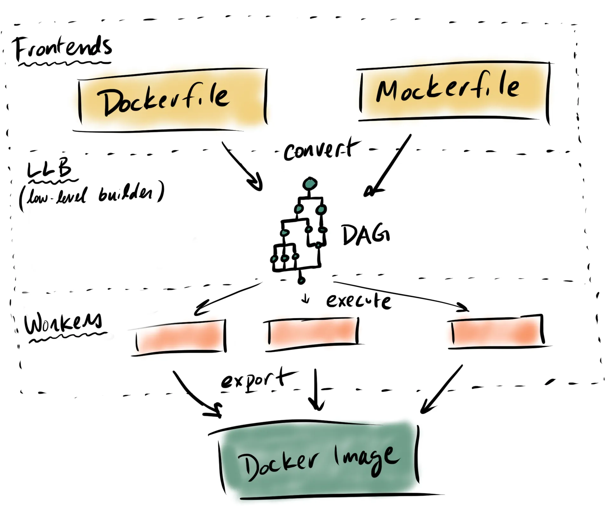
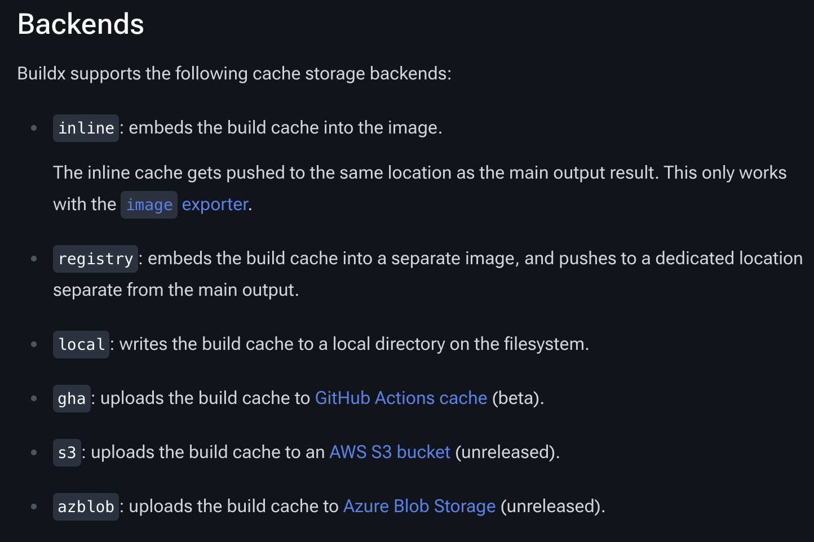

## TL;DR
原本使用的 **Kaniko** 已經 Archived<br/>
Survey **Dcoker BuildKit**<br/>
包含 `Command Line`, `Cache`, `GitLab-CI` 與相關設定

## Docker BuildKit 概觀

### BuildKit 相比傳統 Docker 的優化
可以處理更複雜的情境，包含
- 跳過未使用的 Stage
- 平行打包無相依性的 Stage
- 僅同步有異動的檔案至 Stage
- 僅同步 `build context` 內有被使用到的檔案

### BuildKit 是什麼？
BuildKit 是 `Low-Level Build(LLB)`
例如 `Dockerfile` 或 `Mockerfile` 都經過編譯成 LLB 後，才實際執行打包建構


### 三種 Docker build 指令比較

- docker buildx build
  - 其中最 High-Level 的指令
  - ❌ 需要 Daemon
  - ❌ 不支援 root-less
- buildctl build
  - 比起 docker build 稍為更低階一點
  - ❌ 需要 Daemon
  - ❌ 不支援 root-less
- buildctl-daemonless.sh build
  - 其中最低階
  - ✅ 無需 Daemon
  - ✅ 支援 root-less

```bash
##### 指令範例 #####

# Traditional Docker
docker buildx build -t myimage:latest . --push

# buildctl
buildctl build \
    --frontend dockerfile.v0 \
    --local context=. \
    --local dockerfile=. \
    --output type=image,name="myimage:latest",push=true

# daemonless
buildctl-daemonless.sh build \
    --frontend dockerfile.v0 \
    --local context=. \
    --local dockerfile=. \
    --output type=image,name="myimage:latest",push=true
```

### Cache 機制
```dockerfile
# syntax=docker/dockerfile:1
FROM ubuntu:latest

RUN apt-get update && apt-get install -y build-essentials
COPY main.c Makefile /src/
WORKDIR /src/
RUN make build
```
當有任何一個 Layer 的內容變動，該 Layer 與後續 Layer 會需要 re-build

例如 `main.c` 的內容異動 → `COPY` 之後的 Layer 皆需 re-build


[Cache 種類](https://docs.docker.com/build/cache/backends/)


### 指令範例

```bash
##### 一般情境 #####
tree
.
├── main.c
├── Makefile
└── Dockerfile

buildctl-daemonless.sh build \
    --frontend dockerfile.v0 \
    --local context=. \
    --local dockerfile=. \
    --output type=image,name="myimage:latest",push=true


##### 當 Dockerfile 不在 root #####
tree
.
├── build
│   └── Dockerfile
├── main.c
└── Makefile

buildctl-daemonless.sh build \
    --frontend dockerfile.v0 \
    --local context=. \
    --local dockerfile=. \
    --opt filename=build/Dockerfile \
    --output type=image,name="myimage:latest",push=true

##### 建立 cache #####
tree
.
├── main.c
├── Makefile
└── Dockerfile

CACHE_IMAGE=$CI_REGISTRY_IMAGE:cache
buildctl-daemonless.sh build \
    --frontend dockerfile.v0 \
    --local context=. \
    --local dockerfile=. \
    --export-cache type=registry,ref=$CACHE_IMAGE \
    --import-cache type=registry,ref=$CACHE_IMAGE \
    --output type=image,name="myimage:latest",push=true

##### 建構多平臺 #####
buildctl-daemonless.sh build \
    --frontend dockerfile.v0 \
    --local context=. \
    --local dockerfile=. \
    --opt platform=linux/amd64,linux/arm64 \
    --output type=image,name="myimage:latest",push=true

##### 參數帶入 #####
buildctl-daemonless.sh build \
    --frontend dockerfile.v0 \
    --local context=. \
    --local dockerfile=. \
    --build-arg no_proxy=$no_proxy \
    --output type=image,name="myimage:latest",push=true

```
GitLab-CI 範例
```yaml
build:
  stage: build
  image: moby/BuildKit:rootless
    name: BuildKit
    entrypoint: [""]
  variables:
    DOCKERFILE_PATH: "build/Dockerfile"
    CACHE_IMAGE: $CI_REGISTRY_IMAGE:cache
    BuildKitD_FLAGS: --oci-worker-no-process-sandbox
  script:
    - !reference [.docker-login]
    - !reference [.prepare-image-name]
    - |
      buildctl-daemonless.sh build \
        --frontend dockerfile.v0 \
        --local context=. \
        --local dockerfile=. \
        --opt filename=${DOCKERFILE_PATH} \
        --export-cache type=registry,ref=$CACHE_IMAGE \
        --import-cache type=registry,ref=$CACHE_IMAGE \
        --output type=image,name=$IMAGE_WITH_TAG,push=true
  allow_failure: false
```

### 指令參數說明

Docker context: 讓 Docker 知道能 access 的檔案範圍
```
docker build [OPTIONS] PATH | URL
                       ^^^^^^^^^^
```
---
📌 關鍵字：Docker BuildKit、Kaniko 替代方案、buildctl、daemonless、GitLab CI、container build、Docker cache、multi-platform build、moby/BuildKit、CI/CD pipeline、buildx
