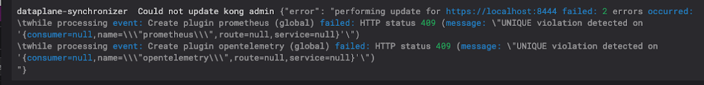
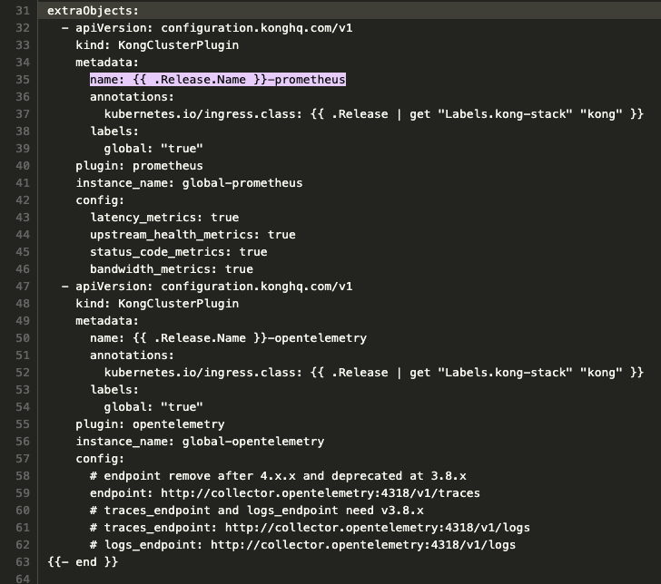
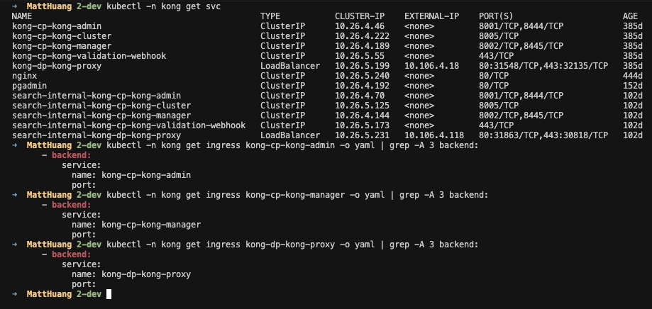
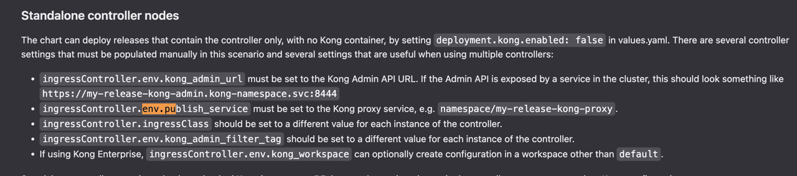

## TL;DR
- Kong API-Gateway error log 問題排除

## 背景
由 RD 研究導入的 Kong API-Gateway 出現大量 error logs
對 SRE 的我們提出問題排查需求

### 內容
- 快速問題定位
- 問題排除

### Create plugin failed: HTTP status 409
最優先看到的是 `409` 的 `Create plugin failed`

然而針對 `409` 的異常官方有文件明確的提及原因 [Kong 官方 409 異常說明](https://support.konghq.com/support/s/article/When-upgrading-KIC-from-1-x-to-2-1-we-are-running-into-HTTP-status-409-message-UNIQUE-violation-detected-on)
這個 Plugin 相關的錯誤
後續在我們自己的版控上，找到有 RD 自行加上相關 Plugin 的 commit

與該 RD 確認後確認
最開始這些 plugin 還沒有版控方式，所以是手動在 Kong UI 上建立
故可能為後續透過版控建立時，因為 Plugin 資源的唯一性導致衝突而造成 Create Failed
後續把當時手動建立的 Plugin 移除後，相關 error log 就消除了

### controller.Ingress "kong-cp-kong-proxy" not found
遇到的第二個 error 如下
```
controllers.Ingress.netv1	Reconciler error	{"reconcileID": "755b7739-b85f-43b5-8b3b-c0f3bf4f7911", "error": "Service \"kong-cp-kong-proxy\" not found"}
```
來源是 kong-cp 這個服務發出來的
大概表明了 Kong 的 ingressController 找不到 kong-cp-kong-proxy 這個服務
同時在 Cluster 上我們可以確認確實找不到這個元件


透過 Kong 的運作架構圖可可以發現
實際上 Kong-cp 他應該要去找的是 kong-dp-kong-proxy 才對

參考:
[Kong Kybrid Mode Deployment: GKE and On-Prem](https://dev.to/zelar/kong-hybrid-mode-deployment-gke-and-on-prem-j32)
相關內容說明位置 [連結](https://dev.to/zelar/kong-hybrid-mode-deployment-gke-and-on-prem-j32#:~:text=publish_service%3A%20kong%2Ddp/kong%2Ddp%2Dkong%2Dproxy)
後續也有在 Kong 的 Helm-chart README.md 內確認到相關設置說明 [連結](https://swissknife.vip/pd/sre/helmfile/-/blob/originmain/outside/kong/chart/README.md?ref_type=heads#:~:text=ingressController.env.publish_service%20must%20be%20set%20to%20the%20Kong%20proxy%20service%2C%20e.g.%20namespace/my%2Drelease%2Dkong%2Dproxy)

完成資源調整後重新部署相關錯誤就消失了
