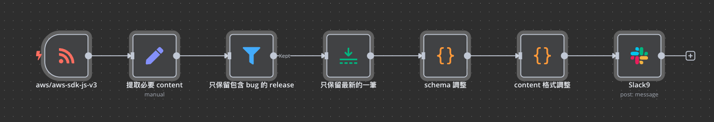

## TL;DR
藉由 n8n 流程自動化，在 Slack 追蹤使用工具更新訊息

## 背景
基於公司內部資安規範我們需要:
- 監控所有使用工具或開發依賴是否有新的 `Release`
- 若內容包含 `Bug Fix`, 通知團隊盡快更新

### 簡介 n8n
善於將流程自動化的工具，每個自動化的步驟稱為「節點」
而節點有分為幾個類別

|類別|說明|範例|
|-|-|-|
|Trigger|負責流程觸發| `cron`, `RSS` |
|Action|執行動作|發送 Slack|
|Flow|控制流程邏輯| `IF` |

### 實際 pipeline 流程範例


> 流程概念：
> 1. 使用 Github Repo 的 RSS Feed 作為 Trigger
> 2. 解析 Release 資料
> 3. 過濾出包含 `Bug` / `fix` 相關資訊
> 4. 透過 Slack 發送通知

其中善用了 `Code` 這個節點可以用 `正則` 的工程手法
大大的優化了對於資料處理的負擔

```json
{
    "name": "Demo Workflow",
    "nodes": [
      {
        "parameters": {
          "authentication": "oAuth2",
          "select": "channel",
          "channelId": {"__rl": true,"value": "#slackbot_testing","mode": "name"},
          "text": "=*Latest `{{ $json.title }}` Version: `{{ $json.version }}`*\n\n修正內容\n{{ $json.bug_lines_array }}\n\nLink to this release: {{ $json.link }} ",
          "otherOptions": {"mrkdwn": true}
        },
        "type": "n8n-nodes-base.slack",
        "typeVersion": 2.3,
        "position": [3740, 340],
        "id": "1c7d1b97-46fc-4c3e-ac7c-2afe8217cb5f",
        "name": "Slack9",
        "webhookId": "45ce39a0-81bc-4d9d-9269-dc094e4fd0bf",
        "credentials": {
          "slackOAuth2Api": {"id": "o6xitxm4o524WlMj","name": "Slack account"}
        }
      },
      {
        "parameters": {
          "assignments": {"assignments": [{"id": "a3aee852-1b9e-4427-b39b-0bb5a8f1054f","name": "title","value": "={{ $json.title }}","type": "string"},{"id": "8f9b1e3b-2d31-46d2-86e3-b4471e24f868","name": "link","value": "={{ $json.link }}","type": "string"},{"id": "b40b90fa-b6b7-46b2-9a95-455031b990f0","name": "content","value": "={{ $json.content }}","type": "string"}]},
          "options": {}
        },
        "type": "n8n-nodes-base.set",
        "typeVersion": 3.4,
        "position": [2640, 340],
        "id": "1150080f-a9f9-4161-acda-7c67955d55f4",
        "name": "提取必要 content"
      },
      {
        "parameters": {
          "conditions": {"options": {"caseSensitive": true,"leftValue": "","typeValidation": "strict","version": 2},"conditions": [{"id": "00f67c78-36f7-4d4d-89b7-131cec2f7745","leftValue": "bug","rightValue": "","operator": {"type": "string","operation": "exists","singleValue": true}}],"combinator": "and"},
          "options": {}
        },
        "type": "n8n-nodes-base.filter",
        "typeVersion": 2.2,
        "position": [2860, 340],
        "id": "a634f44e-bfa9-46c8-9494-6c8b5ddb3c2e",
        "name": "只保留包含 bug 的 release"
      },
      {
        "parameters": {},
        "type": "n8n-nodes-base.limit",
        "typeVersion": 1,
        "position": [3080, 340],
        "id": "15a0aa82-db94-4178-9a11-dae45d2222f8",
        "name": "只保留最新的一筆"
      },
      {
        "parameters": {
          "jsCode": "// Loop over input items and add a new field called 'myNewField' to the JSON of each one\n// for (const item of $input.all()) {\n//   console.log(123)\n// }\n\n// return $input.all();\n\nconst items = $input.all();\n\nfor (const item of items) {\n  const link = item.json.link ?? '';\n  const m = typeof link === 'string'\n    ? link.match(/^https?:\\/\\/github\\.com\\/([^/]+)\\/([^/]+)/)\n    : null;\n  const ownerRepo = m ? `${m[1]}/${m[2]}` : '';\n\n  const t = item.json.title ?? '';\n  const verMatch = typeof t === 'string'\n    ? t.match(/(\\d+(?:\\.\\d+)+)/)\n    : null;\n  const ver = verMatch ? verMatch[1] : '';\n\n  // 依你的需求覆寫/新增欄位\n  item.json.title = ownerRepo;   // 例如 \"facebook/react\"\n  item.json.version = ver;       // 例如 \"19.2.0\"\n  // link、content 原樣保留（已在 item.json 內）\n}\n\nreturn items;\n\n"
        },
        "type": "n8n-nodes-base.code",
        "typeVersion": 2,
        "position": [3300, 340],
        "id": "27d16cc3-d317-4778-ac2c-c5ec1f2fd5ae",
        "name": "schema 調整"
      },
      {
        "parameters": {
          "jsCode": "// Loop over input items and add a new field called 'myNewField' to the JSON of each one\nconst items = $input.all();\n\nfor (const item of items) {\n  const html = item.json.content ?? \"\";\n\n  // 抓出所有 \u003Cli\u003E...\u003C/li\u003E\n  const liMatches = html.match(/\u003Cli[\\s\\S]*?\u003C\\/li\u003E/gi) || [];\n\n  const bugLines = [];\n  for (const li of liMatches) {\n    // 粗略轉純文字（保留錨點/程式碼內文字）\n    const text = li\n      .replace(/\u003Ca[^\u003E]*\u003E(.*?)\u003C\\/a\u003E/gi, \"$1\")\n      .replace(/\u003Ccode[^\u003E]*\u003E(.*?)\u003C\\/code\u003E/gi, \"$1\")\n      .replace(/\u003C[^\u003E]+\u003E/g, \"\")        // 去其他 HTML tag\n      .replace(/\\s+/g, \" \")           // 正規化空白\n      .trim();\n\n    // 關鍵字：fix/fixed/fixes、bug（大小寫不敏感）\n    if (/\\bfix(?:e[sd])?\\b/i.test(text) && /\\bbug\\b/i.test(text)) {\n      bugLines.push(`• ${text}\\n`);\n    }\n  }\n\n  // 產出新欄位：一欄為字串（\\n 分隔），一欄為陣列（可選）\n  item.json.bug_lines = bugLines.join(\"\\n\");\n  item.json.bug_lines_array = bugLines;\n}\n\n\nreturn items;\n"
        },
        "type": "n8n-nodes-base.code",
        "typeVersion": 2,
        "position": [3520, 340],
        "id": "f459cb4c-3fc1-491e-afdd-9d4d57886c03",
        "name": "content 格式調整"
      },
      {
        "parameters": {
          "pollTimes": {"item": [{"mode": "everyMinute"}]},
          "feedUrl": "https://github.com/aws/aws-sdk-js-v3/releases.atom"
        },
        "type": "n8n-nodes-base.rssFeedReadTrigger",
        "typeVersion": 1,
        "position": [2440, 340],
        "id": "f3fbae09-e133-493e-b58d-7182f3efc708",
        "name": "aws/aws-sdk-js-v3"
      }
    ],
    "pinData": {},
    "connections": {
      "提取必要 content": {
        "main": [[{"node": "只保留包含 bug 的 release","type": "main","index": 0}]]
      },
      "只保留包含 bug 的 release": {
        "main": [[{"node": "只保留最新的一筆","type": "main","index": 0}]]
      },
      "只保留最新的一筆": {
        "main": [[{"node": "schema 調整","type": "main","index": 0}]]
      },
      "schema 調整": {
        "main": [[{"node": "content 格式調整","type": "main","index": 0}]]
      },
      "content 格式調整": {
        "main": [[{"node": "Slack9","type": "main","index": 0}]]
      },
      "aws/aws-sdk-js-v3": {
        "main": [[{"node": "提取必要 content","type": "main","index": 0}]]
      }
    },
    "active": false,
    "settings": {
      "executionOrder": "v1"
    },
    "versionId": "",
    "meta": {
      "templateCredsSetupCompleted": true,
      "instanceId": "366e659b0a84dd4a5b72b671325ade3664a8450851ee555bcb35ef1ef2c107a9"
    },
    "tags": []
  }
```
---
📌 關鍵字：n8n、Slack Bot、Release Monitor、自動化通知、GitHub RSS、Bug Fix 追蹤、DevSecOps、CI/CD、自動更新檢查、程式依賴安全監控
