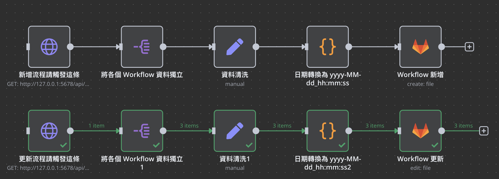
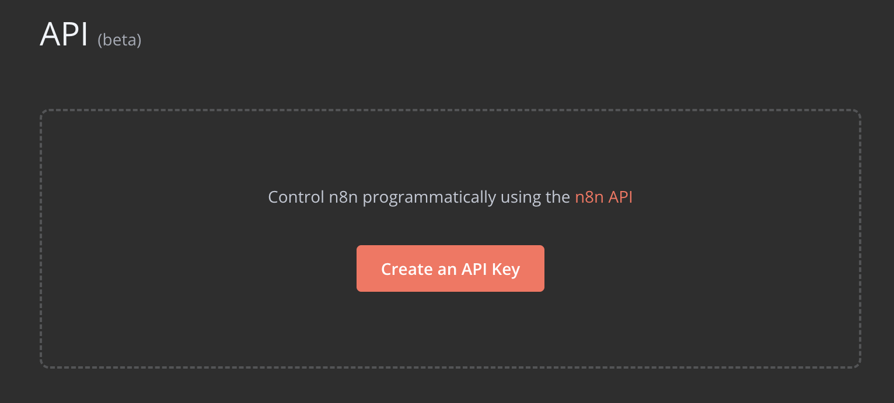
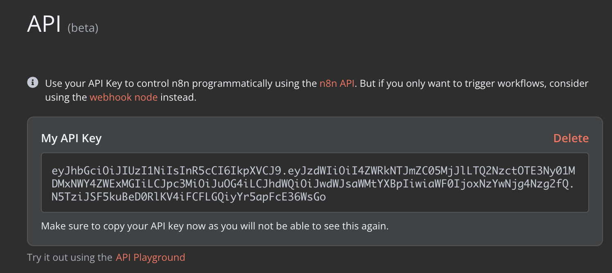
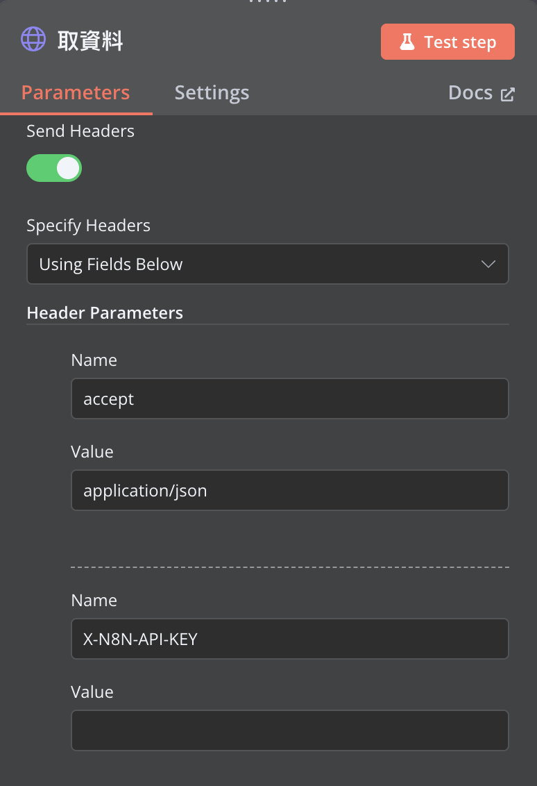
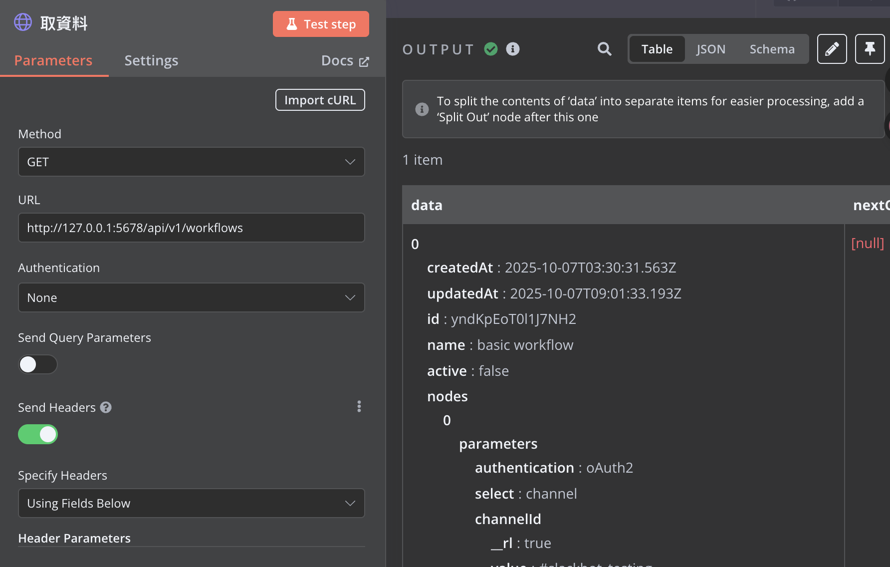
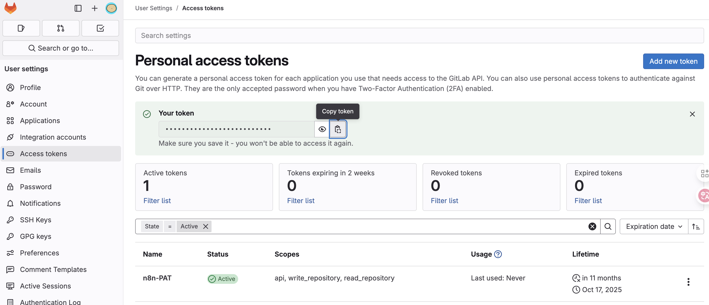
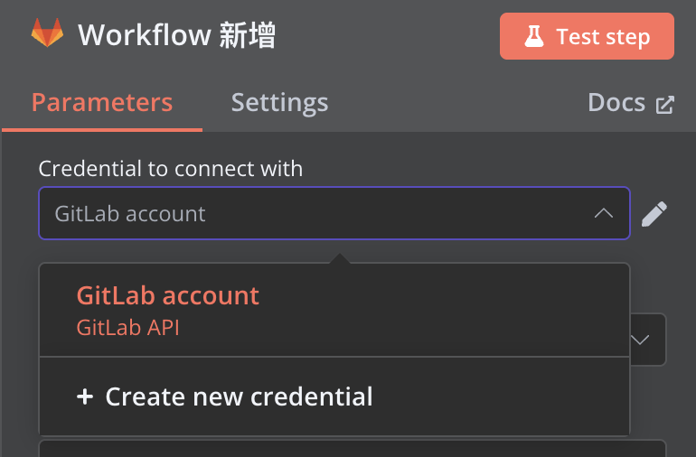
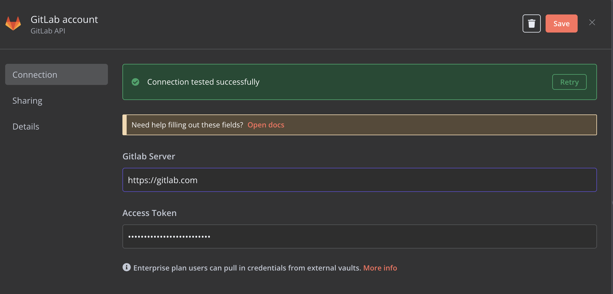
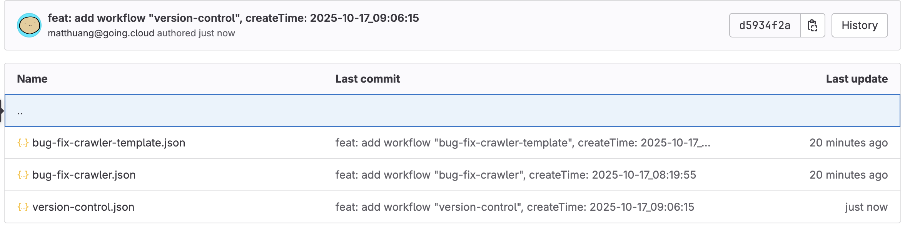

## TL;DR
在自建的 N8N 對 Workflow 版控，推上 Gitlab

## 背景
延續上篇〈[用 n8n 自動追蹤工具更新並發送 Slack 通知：開發依賴安全監控流程實作](https://blog.cosparks.app/posts/n8n-engineering-automation/)〉，開始建立 Workflow 後可以
- 對 Workflow 做**版本版控**。
- 讓每次變更都能被追蹤、比對與回滾。

### 版控流程概覽

- 兩條流程幾乎相同，只差在 **GitLab 節點**：一條用 **Create File**、另一條用 **Edit File**。  
- 先用 **HTTP Request** 向自架 n8n 取得 `workflows` JSON，經過欄位清洗（Split / Set / Code），再送到 GitLab。  

### N8N workflow 資料取得

> 在左下角的 Settings 內找到 Api 並點擊 `Create an API Key` 來建立 n8n API Key
> 產生後只會顯示一次，請妥善保存(離開頁面後就看不到)



建立資料取得的節點 (HTTP Request)
> 分別需要設置 Request & Headers (下面的在完成 Demo 後已刪除)<br/>
> `accept: aaplication/json`<br/>
> `X-N8N-API-KEY: {$your-n8n-api-key}`




資料取得測試


### Gitlab PAT 建立

> `Add new token` 給予 `api`, `write_repository`, `read_repository`



> 在 N8N 的 `Gitlab 節點` 建立 `Credential`
> 填入 `Gitlab Server` 與剛剛的 `Access Token`




> `Edit 行為驗證`：無檔案異動時，不會推 Commit



### 版控 workflow 範例
```json
{
    "createdAt": "2025-10-17T07:48:49.406Z",
    "updatedAt": "2025-10-17_08:43:41",
    "id": "d0KEcmHhtWoSb7QV",
    "name": "version-control",
    "active": false,
    "nodes": [
      {
        "parameters": {},
        "name": "手動觸發",
        "type": "n8n-nodes-base.manualTrigger",
        "typeVersion": 1,
        "position": [
          200,
          80
        ],
        "id": "5d1c9515-1f9e-4037-9b5d-93b18c4a49a3"
      },
      {
        "parameters": {
          "fieldToSplitOut": "data",
          "include": "allOtherFields",
          "options": {}
        },
        "type": "n8n-nodes-base.splitOut",
        "typeVersion": 1,
        "position": [
          640,
          80
        ],
        "id": "8a753163-c45f-4e62-9066-9c48d180b36e",
        "name": "Split Out"
      },
      {
        "parameters": {
          "assignments": {
            "assignments": [
              {
                "id": "6cf83cea-8398-4af7-baba-89146ed9b7ff",
                "name": "name",
                "value": "={{ $json.data.name }}",
                "type": "string"
              },
              {
                "id": "48e48f8d-6d17-4e08-99ca-368028cce60e",
                "name": "filename",
                "value": "={{ 'workflows_'+ $json.data.name }}",
                "type": "string"
              },
              {
                "id": "7ec7c64e-782a-4204-9f97-6d7a7a7ccdda",
                "name": "versionId",
                "value": "={{ $json.data.versionId }}",
                "type": "string"
              },
              {
                "id": "40d5161f-fc07-4e11-9bdd-145a8de3d0aa",
                "name": "data",
                "value": "={{ $json.data }}",
                "type": "object"
              },
              {
                "id": "8093b35c-0ec2-46c3-91c7-b2b8e458b2e4",
                "name": "date",
                "value": "={{ $now.setZone('Asia/Taipei').toFormat('yyyy-LL-dd') }}",
                "type": "string"
              }
            ]
          },
          "options": {}
        },
        "type": "n8n-nodes-base.set",
        "typeVersion": 3.4,
        "position": [
          860,
          80
        ],
        "id": "c218324c-614f-4083-8051-0e9bded46c49",
        "name": "Edit Fields"
      },
      {
        "parameters": {
          "jsCode": "// Loop over input items and add a new field called 'myNewField' to the JSON of each one\nfor (const item of $input.all()) {\n  const date = new Date(item.json.data.updatedAt);\n  \n  const yyyy = date.getFullYear();\n  const MM = String(date.getMonth() + 1).padStart(2, '0');\n  const dd = String(date.getDate()).padStart(2, '0');\n  const hh = String(date.getHours()).padStart(2, '0');\n  const mm = String(date.getMinutes()).padStart(2, '0');\n  const ss = String(date.getSeconds()).padStart(2, '0');\n  \n  item.json.data.updatedAt = `${yyyy}-${MM}-${dd}_${hh}:${mm}:${ss}`;\n}\nreturn $input.all();"
        },
        "type": "n8n-nodes-base.code",
        "typeVersion": 2,
        "position": [
          1080,
          80
        ],
        "id": "bbb3e39a-d86e-4977-96b8-01e41617fe6a",
        "name": "日期轉換為 yyyy-MM-dd_hh:mm:ss"
      },
      {
        "parameters": {
          "url": "http://127.0.0.1:5678/api/v1/workflows",
          "sendHeaders": true,
          "headerParameters": {
            "parameters": [
              {
                "name": "accept",
                "value": "application/json"
              },
              {
                "name": "X-N8N-API-KEY",
                "value": ""
              }
            ]
          },
          "options": {}
        },
        "type": "n8n-nodes-base.httpRequest",
        "typeVersion": 4.2,
        "position": [
          420,
          80
        ],
        "id": "4a4b8f66-c971-41e8-ac66-cdb069860a0f",
        "name": "取資料"
      },
      {
        "parameters": {
          "resource": "file",
          "owner": "going-cloud/team/sre",
          "repository": "toolbox",
          "filePath": "={{ 'n8n-workflows/'+$json.name + '.json' }}",
          "fileContent": "={{ JSON.stringify($json.data) }}",
          "commitMessage": "={{ 'feat: add workflow \"' + $json.data.name + '\", createTime: ' + $json.data.updatedAt }}",
          "branch": "n8n"
        },
        "type": "n8n-nodes-base.gitlab",
        "typeVersion": 1,
        "position": [
          1300,
          80
        ],
        "id": "e27d051b-b40a-4779-8e55-c660d552da9b",
        "name": "推檔案1",
        "retryOnFail": true,
        "credentials": {
          "gitlabApi": {
            "id": "FKWnY3maIfc2FxZ4",
            "name": "GitLab account"
          }
        }
      },
      {
        "parameters": {
          "fieldToSplitOut": "data",
          "include": "allOtherFields",
          "options": {}
        },
        "type": "n8n-nodes-base.splitOut",
        "typeVersion": 1,
        "position": [
          640,
          280
        ],
        "id": "cf7bb454-9175-4176-8ee2-f64274e03d73",
        "name": "Split Out2"
      },
      {
        "parameters": {
          "assignments": {
            "assignments": [
              {
                "id": "6cf83cea-8398-4af7-baba-89146ed9b7ff",
                "name": "name",
                "value": "={{ $json.data.name }}",
                "type": "string"
              },
              {
                "id": "48e48f8d-6d17-4e08-99ca-368028cce60e",
                "name": "filename",
                "value": "={{ 'workflows_'+ $json.data.name }}",
                "type": "string"
              },
              {
                "id": "7ec7c64e-782a-4204-9f97-6d7a7a7ccdda",
                "name": "versionId",
                "value": "={{ $json.data.versionId }}",
                "type": "string"
              },
              {
                "id": "40d5161f-fc07-4e11-9bdd-145a8de3d0aa",
                "name": "data",
                "value": "={{ $json.data }}",
                "type": "object"
              },
              {
                "id": "8093b35c-0ec2-46c3-91c7-b2b8e458b2e4",
                "name": "date",
                "value": "={{ $now.setZone('Asia/Taipei').toFormat('yyyy-LL-dd') }}",
                "type": "string"
              }
            ]
          },
          "options": {}
        },
        "type": "n8n-nodes-base.set",
        "typeVersion": 3.4,
        "position": [
          860,
          280
        ],
        "id": "ed1a1c9a-1674-43fe-8b90-289c2f575b64",
        "name": "Edit Fields2"
      },
      {
        "parameters": {
          "jsCode": "// Loop over input items and add a new field called 'myNewField' to the JSON of each one\nfor (const item of $input.all()) {\n  const date = new Date(item.json.data.updatedAt);\n  \n  const yyyy = date.getFullYear();\n  const MM = String(date.getMonth() + 1).padStart(2, '0');\n  const dd = String(date.getDate()).padStart(2, '0');\n  const hh = String(date.getHours()).padStart(2, '0');\n  const mm = String(date.getMinutes()).padStart(2, '0');\n  const ss = String(date.getSeconds()).padStart(2, '0');\n  \n  item.json.data.updatedAt = `${yyyy}-${MM}-${dd}_${hh}:${mm}:${ss}`;\n}\nreturn $input.all();"
        },
        "type": "n8n-nodes-base.code",
        "typeVersion": 2,
        "position": [
          1080,
          280
        ],
        "id": "fe2dee64-19e5-46be-bd0a-d434b8ba8e2f",
        "name": "日期轉換為 yyyy-MM-dd_hh:mm:ss2"
      },
      {
        "parameters": {
          "url": "http://127.0.0.1:5678/api/v1/workflows",
          "sendHeaders": true,
          "headerParameters": {
            "parameters": [
              {
                "name": "accept",
                "value": "application/json"
              },
              {
                "name": "X-N8N-API-KEY",
                "value": ""
              }
            ]
          },
          "options": {}
        },
        "type": "n8n-nodes-base.httpRequest",
        "typeVersion": 4.2,
        "position": [
          420,
          280
        ],
        "id": "e29ddfc3-966d-436e-beba-eb08c5be3258",
        "name": "取資料1"
      },
      {
        "parameters": {
          "resource": "file",
          "operation": "edit",
          "owner": "going-cloud/team/sre",
          "repository": "toolbox",
          "filePath": "={{ 'n8n-workflows/'+$json.name + '.json' }}",
          "fileContent": "={{ JSON.stringify($json.data) }}",
          "commitMessage": "={{ 'feat: add workflow \"' + $json.data.name + '\", createTime: ' + $json.data.updatedAt }}",
          "branch": "n8n"
        },
        "type": "n8n-nodes-base.gitlab",
        "typeVersion": 1,
        "position": [
          1300,
          280
        ],
        "id": "13daaf78-d576-40fb-b9bf-8ae32a1d1a0e",
        "name": "推檔案2",
        "retryOnFail": true,
        "credentials": {
          "gitlabApi": {
            "id": "FKWnY3maIfc2FxZ4",
            "name": "GitLab account"
          }
        }
      }
    ],
    "connections": {
      "手動觸發": {
        "main": [
          [
            {
              "node": "取資料",
              "type": "main",
              "index": 0
            }
          ]
        ]
      },
      "Split Out": {
        "main": [
          [
            {
              "node": "Edit Fields",
              "type": "main",
              "index": 0
            }
          ]
        ]
      },
      "Edit Fields": {
        "main": [
          [
            {
              "node": "日期轉換為 yyyy-MM-dd_hh:mm:ss",
              "type": "main",
              "index": 0
            }
          ]
        ]
      },
      "日期轉換為 yyyy-MM-dd_hh:mm:ss": {
        "main": [
          [
            {
              "node": "推檔案1",
              "type": "main",
              "index": 0
            }
          ]
        ]
      },
      "取資料": {
        "main": [
          [
            {
              "node": "Split Out",
              "type": "main",
              "index": 0
            }
          ]
        ]
      },
      "Split Out2": {
        "main": [
          [
            {
              "node": "Edit Fields2",
              "type": "main",
              "index": 0
            }
          ]
        ]
      },
      "Edit Fields2": {
        "main": [
          [
            {
              "node": "日期轉換為 yyyy-MM-dd_hh:mm:ss2",
              "type": "main",
              "index": 0
            }
          ]
        ]
      },
      "日期轉換為 yyyy-MM-dd_hh:mm:ss2": {
        "main": [
          [
            {
              "node": "推檔案2",
              "type": "main",
              "index": 0
            }
          ]
        ]
      },
      "取資料1": {
        "main": [
          [
            {
              "node": "Split Out2",
              "type": "main",
              "index": 0
            }
          ]
        ]
      }
    },
    "settings": {
      "executionOrder": "v1"
    },
    "staticData": null,
    "meta": {
      "templateCredsSetupCompleted": true
    },
    "pinData": {},
    "triggerCount": 0,
    "tags": []
  }
```

---
📌 關鍵字：n8n、Workflow 版控、GitLab、Personal Access Token、HTTP Request、API Key、自動化備份、DevSecOps、Create File、Edit File、避免空提交
