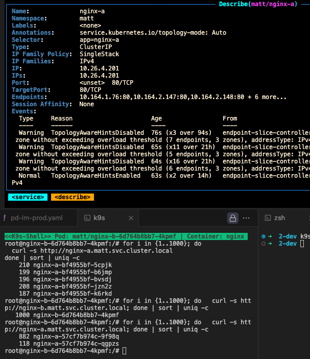
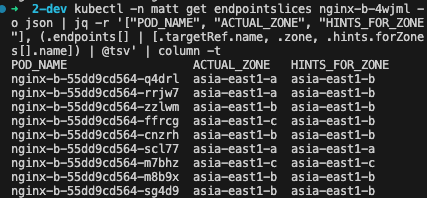
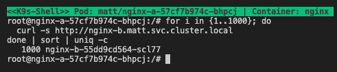
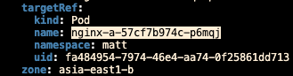
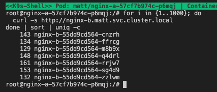

## TL;DR
Topology Aware Routing (TAR) 的設置與**實測流量分配**行為觀察：  
- 目的：上多區後希望降低跨區傳輸成本  
- 作法：在 `Service` 加上 `service.kubernetes.io/topology-mode: "Auto"`  
- 實測：EndpointSlice 會依資源比例分配 zone 配額，但 **Pod 數量不足時 TAR 會 `Disabled`**，流量回退為 `round-robin`

---

## 背景
公司服務從單 zone 升級為 **multi-zone** 後，**跨 zone 傳輸費用暴增**。期望透過 **Topology Aware Routing (TAR)** 在支援多區的同時，**降低跨區傳輸**。

---

## 設置 TAR
在對應服務的 `Service` 標註：

```yaml
annotations:
  service.kubernetes.io/topology-mode: "Auto"
```
> 目的：讓 kube-proxy / EndpointSlice 依拓樸「偏好近端」路徑，盡量將流量留在發起請求的同一個 zone。

### 測試設定（Deployment / Service / ConfigMap）
> 使用 `topologySpreadConstraints` 讓 Pod 盡量平均落在各 zone，以便觀察 TAR 的分配。
```yaml
apiVersion: apps/v1
kind: Deployment
metadata:
  name: nginx-a
  namespace: matt
spec:
  replicas: 3
  selector:
    matchLabels:
      app: nginx-a
  template:
    metadata:
      labels:
        app: nginx-a
    spec:
      # 使用 topologySpreadConstraints 強制平均分佈
      topologySpreadConstraints:
        - maxSkew: 1  # 最多允許相差 1 個 Pod
          topologyKey: topology.kubernetes.io/zone
          whenUnsatisfiable: DoNotSchedule
          labelSelector:
            matchLabels:
              app: nginx-a
      # 移除原本的 podAntiAffinity，因為 topologySpreadConstraints 已經處理分佈
      containers:
        - name: nginx
          image: nginx:latest
          ports:
            - containerPort: 80
          volumeMounts:
            - name: nginx-conf
              mountPath: /etc/nginx/conf.d
          resources:
            requests:
              cpu: "100m"
              memory: "128Mi"
            limits:
              cpu: "200m"
              memory: "256Mi"
      volumes:
        - name: nginx-conf
          configMap:
            name: nginx-conf
---
apiVersion: v1
kind: Service
metadata:
  name: nginx-a
  namespace: matt
  annotations:
    service.kubernetes.io/topology-mode: "Auto"
spec:
  selector:
    app: nginx-a
  ports:
    - protocol: TCP
      port: 80
      targetPort: 80
---
apiVersion: v1
kind: ConfigMap
metadata:
  name: nginx-conf
  namespace: matt
data:
  default.conf: |
    server {
      listen 80;
      location / {
        return 200 "$hostname\n";
      }
    }
```

### 實測觀察：TAR Disabled 與啟用條件

- 在僅 2 個 nginx Pod的情境下，TAR 可正常運作
- 在測試環境內，TAR 顯示 `Disabled` 且仍為 `round-robin` 的分配機制，待 Pod 數量充足後才會正常啟用



#### TAR 運作機制

1. 服務 `svc` 設置 `annotation` –> 影響 `Endpoint-Slice` 分配機制

2. `Endpoint-Slice` 分配規則傾向「依資源比例」
以節點 CPU 資源近似評估 zone 權重（示意）：
```js
const nodes = [
    // asia-east1-a
    { zone: 'asia-east1-a', name: 'gke-matt-test-3b627bce-daoo', cpu: 4 },
    { zone: 'asia-east1-a', name: 'gke-pool-A-548e8958-2nxn', cpu: 8 },
    
    // asia-east1-b (10個節點)
    { zone: 'asia-east1-b', name: 'gke-pool-A-7ae1a02a-1fv1', cpu: 8 },
    { zone: 'asia-east1-b', name: 'gke-pool-A-7ae1a02a-8bjj', cpu: 8 },
    { zone: 'asia-east1-b', name: 'gke-pool-A-7ae1a02a-crk9', cpu: 8 },
    { zone: 'asia-east1-b', name: 'gke-pool-A-7ae1a02a-ft1u', cpu: 8 },
    { zone: 'asia-east1-b', name: 'gke-pool-A-7ae1a02a-j7jg', cpu: 8 },
    { zone: 'asia-east1-b', name: 'gke-pool-A-7ae1a02a-lvc8', cpu: 8 },
    { zone: 'asia-east1-b', name: 'gke-pool-A-7ae1a02a-px2g', cpu: 8 },
    { zone: 'asia-east1-b', name: 'gke-pool-A-7ae1a02a-z5z4', cpu: 8 },
    { zone: 'asia-east1-b', name: 'gke-pool-B-bfdf247d-9f1e', cpu: 8 },
    { zone: 'asia-east1-b', name: 'gke-pool-B-bfdf247d-xg6b', cpu: 8 },
    
    // asia-east1-c
    { zone: 'asia-east1-c', name: 'gke-matt-test-e8520bea-zpl4', cpu: 4 }
  ];
```
換算（示意）：
```
asia-east1-a: 12 cores ÷ 96 total cores = 12.5%
asia-east1-b: 80 cores ÷ 96 total cores = 83.3% 
asia-east1-c: 4 cores ÷ 96 total cores = 4.2%
```
為確保每個 zone 至少有一個實例（避免極端 0 配額），實際分配近似：
| zone-a | zone-b | zone-c |
| ------ | ------ | ------ |
| 1      | 7      | 1      |

#### 流量測試
從 `zone-a` 由 `nginx-a` 發起 request：
流量幾乎都由同 zone 的單一 `nginx-b` 承擔




從 zone-b 由 nginx-a 發起 request：




回查 `EndpointSlice` 分配後，對負責 7 個 `zone-b` 的 `nginx-b` 以 `Round-Robin` 的機制進行輪詢

### 結論

1. 讓服務均勻分布在 3 個 zone 上，才能讓 TAR 的機制最佳化
2. 如果 request 的來源集中在同一個 zone
那還是會有 `流量傾斜` 的情況

---

📌 **關鍵字**：Kubernetes、Topology Aware Routing、TAR、GKE、Multi-Zone、跨區流量費用、EndpointSlice、Service Routing、K8s Networking、流量分配機制、Zone 負載平衡、成本優化
