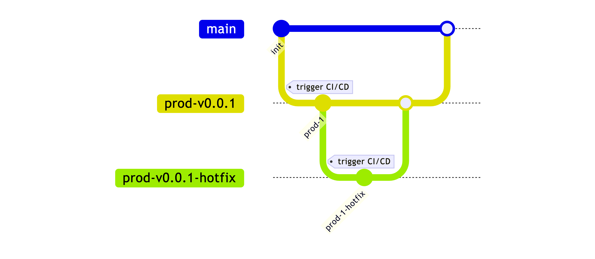
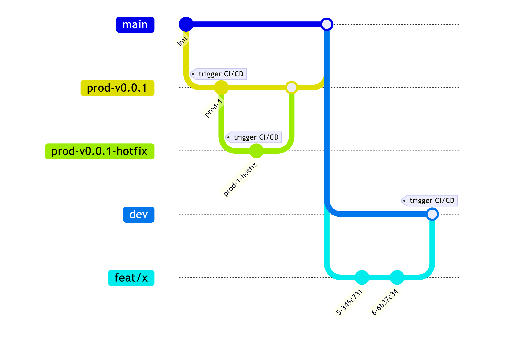
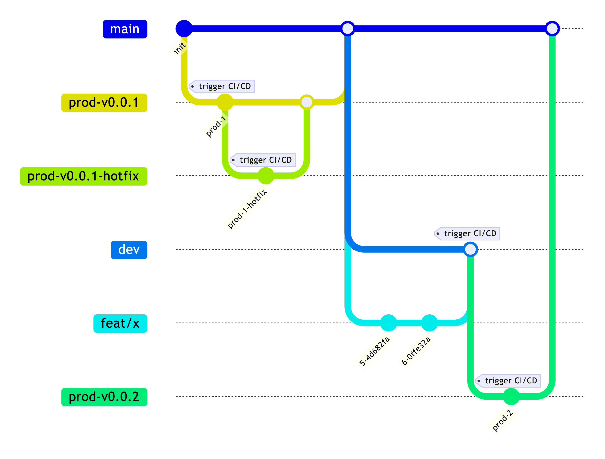
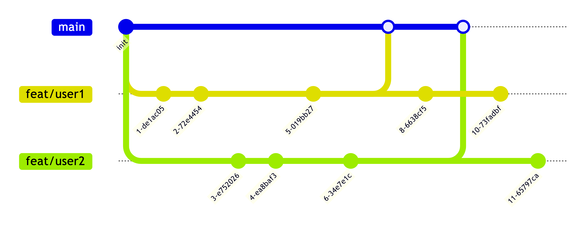
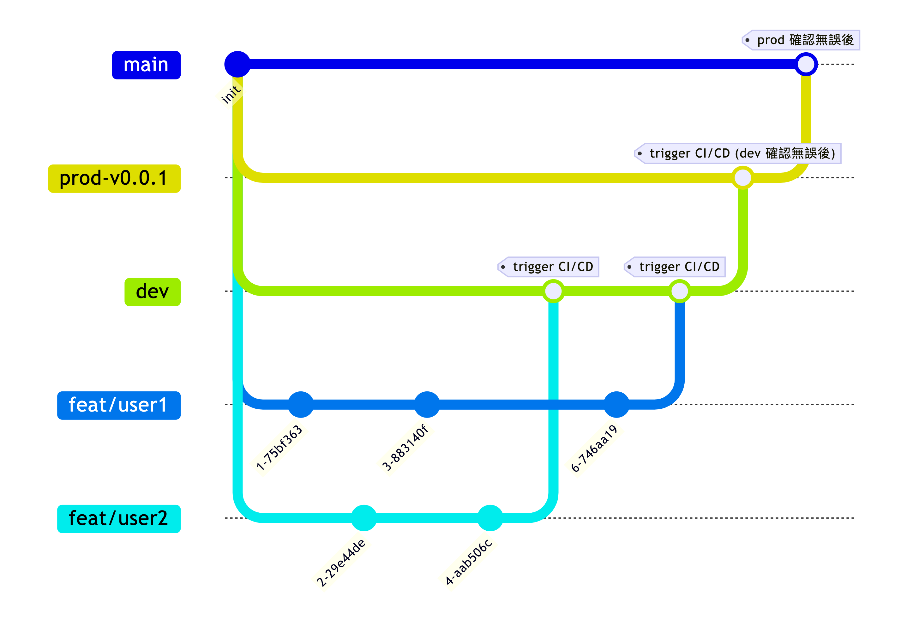
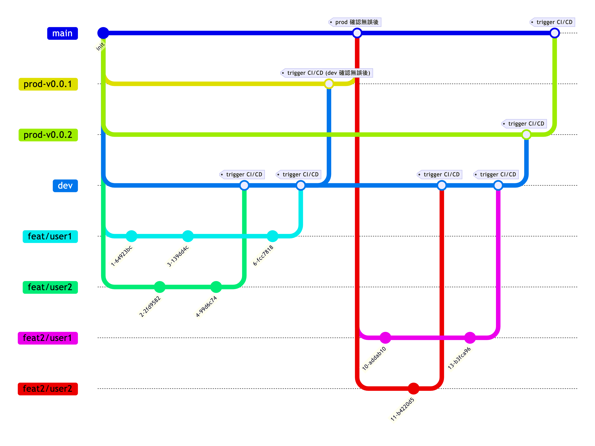

## TL;DR
- 概述 Git 上使用主幹開發策略的好處與一些 Trade-off
- 適用約 30 人左右的開發人數

## 背景
公司與 Side-project 大量使用短分支策略
近期發現在 Side-Project 沒有好好的說明，這套策略的使用方式
導致出現一些誤用

### 短分支策策略
- 主幹開發，最終回到 main 管理
- 以 feature 劃分，透過 branch 同步管理線上服務版本

### 短分支策略操作說明
重點在於，短生命週期的分支
下面是 init project 之後，部署到 prod 的操作範例

❓ 這時候可能有人會問，如果我 prod 部署後發現一些小 bug，怎麼上 hotfix?
我的邏輯會是
從該版本 `checkout` 一個 `hotfix` 的分支後部署，確認都沒問題再依序 `merge` 回 `main`

❗ 幾經輪迴，服務量體開始變大之後，可能會需要一個 dev 環境來測試對吧？
這時候我們可以
1. checkout 一個 dev 分支
2. 在上面開 feature 分支
3. 在本地確認功能都沒問題後 merge 到 dev 觸發 CI/CD 到 dev 環境確認服務是否正常

在 Dev 確認無誤後呢，就可以上到 prod ，並在確認服務正常無誤後呢，開始依序回到 main 分支管理

### ❓ 這時候有些小夥伴可能會問：為什麼要這麼麻煩呢？全部推到 main 去觸發更新不就好呢嗎？
想像一下，如果是多人協作的情況下 Git 可能會變得複雜
如果是下列情況，每個人隨時推到 main

當服務上線一段時間才異常時，我們並不好確認到底是哪個 commit 造成異常
也因為沒有 release 版本，不好 `退回到上一版` 迅速讓服務恢復
透過 `revert` 復原也容易讓 Git 的點變得髒亂

#### 多人協作下的短分支策略
feature 該完成的功能在 dev 測試確認無誤後
checkout 到 `prod-*` 觸發 prod 環境部署
最後回到 main 管理

在新的 feature
RD 一樣從 main checkout 對應 feature 的分支進行開發
並 merge 到 dev 做功能確認
在部署到 prod 時，新 featrue 會給對應的版本版號(prod-v0.0.2)進行部署
最後再回到 main 管理

這時候即使 `prod-v0.0.2` 這個版本再發佈後有任何異常是無法在短時間內進行 hotfix
也可以透過 trigger `prod-v0.0.1` 的版本快速復原
等到 `prod-v0.0.2` 完善後，再重新 release
