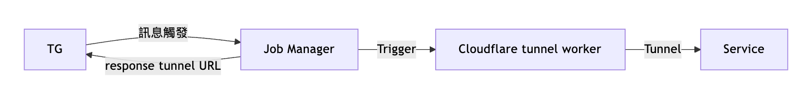

## TL;DR
藉由 `cloudflare-tunnel` 在 `Kubernetes(GKE)` 內為 `Grafana` 搭建**臨時的安全通道**，避免長期對外暴露，同時保有臨時觀測維運需求。

## 背景
我在 GKE 上部署了 `kube-prometheus-stack` 做服務 `metrics` 監控，但不想讓「Grafana 長期暴露」成為風險。因此規劃以**事件驅動**的方式，動態建立 `Cloudflare Tunnel` —— 也就是本文的 `tunnel-worker-controller`。

- **目標**：按需產生臨時、可控存取的 Grafana 外部 URL  
- **做法**：由控制器透過 K8s API 建立一次性 Job，啟動 `cloudflared`，並回傳臨時 URL

## Tech Stack
- Cloudflare Tunnel
- Node.js
- Kubernetes (GKE)

## 流程圖


---

## 1 Job Manager 觸發 K8s 資源建立
透過服務與 K8s 原生 API Server 互動，動態建立 `Job`。

`job-manager.js`
```javascript
async function createJob() {
  return new Promise(async (resolve, reject) => {
    const token = fs.readFileSync('/var/run/secrets/kubernetes.io/serviceaccount/token', 'utf8');
    const caCert = fs.readFileSync('/var/run/secrets/kubernetes.io/serviceaccount/ca.crt');
    
    const hostname = await getKubernetesApiHost();
    console.log(`嘗試在 ${hostname} 建立 Job`);

    const postData = JSON.stringify({
      apiVersion: "batch/v1",
      kind: "Job",
      metadata: { name: "cf-job" },
      spec: {
        ttlSecondsAfterFinished: 10,
        template: {
          spec: {
            restartPolicy: "Never",
            containers: [
              {
                name: "tunnel",
                image: "tunnel:latest",
                command: ["/bin/sh", "-c"],
                args: ["cloudflared tunnel --url http://url:port & sleep 60;"],
                imagePullPolicy: "IfNotPresent"
              }
            ]
          }
        }
      }
    });

    const options = {
      hostname: hostname,
      port: 443,
      path: '/apis/batch/v1/namespaces/default/jobs',
      method: 'POST',
      headers: {
        'Authorization': `Bearer ${token}`,
        'Content-Type': 'application/json',
        'Content-Length': Buffer.byteLength(postData),
      },
      ca: caCert,
    };

    const req = https.request(options, (res) => {
      let data = '';

      console.log(`狀態碼: ${res.statusCode}`);

      res.on('data', (chunk) => {
        data += chunk;
      });

      res.on('end', () => {
        console.log('回應資料:', data);
        if (res.statusCode === 201) {
          resolve(data);
        } else {
          reject(new Error(`Job 建立失敗，狀態碼: ${res.statusCode}`));
        }
      });
    });

  });

}
```

## 2 使用可執行 cloudflared 的 Image 來建立 Job
`dockerfile.tunner`
```docker
FROM ubuntu:20.04

RUN apt-get update && apt-get install -y curl

# 安裝 cloudflared
RUN curl -L https://github.com/cloudflare/cloudflared/releases/latest/download/cloudflared-linux-amd64 -o /usr/local/bin/cloudflared \
    && chmod +x /usr/local/bin/cloudflared

# 將你的應用程式放進 container，假設執行在 3000
# COPY app /app

EXPOSE 3000
CMD ["cloudflared", "version"]
```

## 3 回報產生的 Cloudflared URL
在控制器路由中：建立 Job → 等 Pod Ready → 等 tunnel 起來 → 抓 logs → 擷取臨時 URL 回傳。

```javascript
app.post('/runjob', (req, res) => {
  console.log(`Cloudflared tunnel 將在 3 秒後啟動`);
  
  setTimeout(async() => {
    try {
      // 建立 Job
      await createJob();
      console.log('Job 建立成功，等待 Pod 啟動...');
      
      // 等待 Pod 準備好
      const podName = await waitForPodReady('cf-job');
      if (!podName) {
        res.status(500).json({ error: 'Cloudflared tunnel 啟動失敗：找不到 Pod' });
        return;
      }
      
      // 等待 tunnel 完全啟動
      console.log('Pod 已啟動，等待 tunnel 建立...');
      await new Promise(r => setTimeout(r, 8000));
      
      // 取得 logs
      const logs = await getPodLogs(podName);
      console.log('Pod logs:', logs);
      
      // 從 logs 中提取 tunnel URL
      const match = logs.match(/https:\/\/[a-z0-9\-]+\.trycloudflare\.com/);
      if (!match) {
        throw new Error('找不到 tunnel URL');
      }

      console.log(`找到 tunnel URL: ${match[0]}`);
      res.status(200).json({ tunnelUrl: match[0] });
      
    } catch (err) {
      console.error('錯誤:', err);
      res.status(500).json({ error: `Cloudflared tunnel 啟動失敗: ${err.message}` });
    }
  }, 3000);
});
```

## 4 實際操作 Logs
Pod 內觸發:
```bash
<<K9s-Shell>> Pod: default/jobmanager | Container: jobmanager
/app # curl -X POST http://localhost:3000/runjob
{"tunnelUrl":"https://woods-appreciate-paying-felt.trycloudflare.com"}
```
服務端 Logs:
```log
➜  tunnel git:(main) kubectl logs pods/jobmanager 
Server is running on port 3000
Cloudflared tunnel 將在 3 秒後啟動
嘗試在 192.168.194.129 建立 Job
狀態碼: 201
回應資料: {"kind":"Job","apiVersion":"batch/v1","metadata":{"name":"cf-job","namespace":"default","uid":"45744335-098f-4b66-94fd-883ae1d888b0","resourceVersion":"8637","generation":1,"creationTimestamp":"2025-06-12T06:50:48Z","labels":{"batch.kubernetes.io/controller-uid":"45744335-098f-4b66-94fd-883ae1d888b0","batch.kubernetes.io/job-name":"cf-job","controller-uid":"45744335-098f-4b66-94fd-883ae1d888b0","job-name":"cf-job"},"managedFields":[{"manager":"unknown","operation":"Update","apiVersion":"batch/v1","time":"2025-06-12T06:50:48Z","fieldsType":"FieldsV1","fieldsV1":{"f:spec":{"f:backoffLimit":{},"f:completionMode":{},"f:completions":{},"f:manualSelector":{},"f:parallelism":{},"f:podReplacementPolicy":{},"f:suspend":{},"f:template":{"f:spec":{"f:containers":{"k:{\"name\":\"tunnel\"}":{".":{},"f:args":{},"f:command":{},"f:image":{},"f:imagePullPolicy":{},"f:name":{},"f:resources":{},"f:terminationMessagePath":{},"f:terminationMessagePolicy":{}}},"f:dnsPolicy":{},"f:restartPolicy":{},"f:schedulerName":{},"f:securityContext":{},"f:terminationGracePeriodSeconds":{}}},"f:ttlSecondsAfterFinished":{}}}}]},"spec":{"parallelism":1,"completions":1,"backoffLimit":6,"selector":{"matchLabels":{"batch.kubernetes.io/controller-uid":"45744335-098f-4b66-94fd-883ae1d888b0"}},"manualSelector":false,"template":{"metadata":{"creationTimestamp":null,"labels":{"batch.kubernetes.io/controller-uid":"45744335-098f-4b66-94fd-883ae1d888b0","batch.kubernetes.io/job-name":"cf-job","controller-uid":"45744335-098f-4b66-94fd-883ae1d888b0","job-name":"cf-job"}},"spec":{"containers":[{"name":"tunnel","image":"tunnel:latest","command":["/bin/sh","-c"],"args":["cloudflared tunnel --url http://server-service.default.svc.cluster.local:3000 \u0026 sleep 60;"],"resources":{},"terminationMessagePath":"/dev/termination-log","terminationMessagePolicy":"File","imagePullPolicy":"IfNotPresent"}],"restartPolicy":"Never","terminationGracePeriodSeconds":30,"dnsPolicy":"ClusterFirst","securityContext":{},"schedulerName":"default-scheduler"}},"ttlSecondsAfterFinished":10,"completionMode":"NonIndexed","suspend":false,"podReplacementPolicy":"TerminatingOrFailed"},"status":{}}

Job 建立成功，等待 Pod 啟動...
嘗試連接 Kubernetes API: 192.168.194.129
嘗試連接 Kubernetes API: 192.168.194.129
找到 Pod: cf-job-x65v9
Pod 已啟動，等待 tunnel 建立...
嘗試從 192.168.194.129 取得 Pod logs
Pod logs: 2025-06-12T06:50:49Z INF Thank you for trying Cloudflare Tunnel. Doing so, without a Cloudflare account, is a quick way to experiment and try it out. However, be aware that these account-less Tunnels have no uptime guarantee, are subject to the Cloudflare Online Services Terms of Use (https://www.cloudflare.com/website-terms/), and Cloudflare reserves the right to investigate your use of Tunnels for violations of such terms. If you intend to use Tunnels in production you should use a pre-created named tunnel by following: https://developers.cloudflare.com/cloudflare-one/connections/connect-apps
2025-06-12T06:50:49Z INF Requesting new quick Tunnel on trycloudflare.com...
2025-06-12T06:50:53Z INF +--------------------------------------------------------------------------------------------+
2025-06-12T06:50:53Z INF |  Your quick Tunnel has been created! Visit it at (it may take some time to be reachable):  |
2025-06-12T06:50:53Z INF |  https://woods-appreciate-paying-felt.trycloudflare.com                                    |
2025-06-12T06:50:53Z INF +--------------------------------------------------------------------------------------------+
2025-06-12T06:50:53Z INF Cannot determine default configuration path. No file [config.yml config.yaml] in [~/.cloudflared ~/.cloudflare-warp ~/cloudflare-warp /etc/cloudflared /usr/local/etc/cloudflared]
2025-06-12T06:50:53Z INF Version 2025.6.0 (Checksum 173276e3370f366493fb818ebe33cca23a9601d721ca3c03085b3f838eaf3ca9)
2025-06-12T06:50:53Z INF GOOS: linux, GOVersion: go1.24.2, GoArch: amd64
2025-06-12T06:50:53Z INF Settings: map[ha-connections:1 protocol:quic url:http://server-service.default.svc.cluster.local:3000]
2025-06-12T06:50:53Z INF Autoupdate frequency is set autoupdateFreq=86400000
2025-06-12T06:50:53Z INF Generated Connector ID: 60bce1a3-512e-4fc7-a13e-769605269cb0
2025-06-12T06:50:53Z INF Initial protocol quic
2025-06-12T06:50:53Z INF ICMP proxy will use 192.168.194.57 as source for IPv4
2025-06-12T06:50:53Z INF ICMP proxy will use fd07:b51a:cc66:a::39 in zone eth0 as source for IPv6
2025-06-12T06:50:53Z INF ICMP proxy will use 192.168.194.57 as source for IPv4
2025-06-12T06:50:53Z INF ICMP proxy will use fd07:b51a:cc66:a::39 in zone eth0 as source for IPv6
2025-06-12T06:50:53Z INF Starting metrics server on 127.0.0.1:20241/metrics
2025-06-12T06:50:53Z INF Tunnel connection curve preferences: [X25519MLKEM768 CurveID(25497) CurveP256] connIndex=0 event=0 ip=198.41.192.227
2025/06/12 06:50:53 failed to sufficiently increase receive buffer size (was: 208 kiB, wanted: 7168 kiB, got: 416 kiB). See https://github.com/quic-go/quic-go/wiki/UDP-Buffer-Sizes for details.
2025-06-12T06:50:54Z INF Registered tunnel connection connIndex=0 connection=7afeed09-acc7-4346-ab16-279c92bd901e event=0 ip=198.41.192.227 location=hkg01 protocol=quic

找到 tunnel URL: https://woods-appreciate-paying-felt.trycloudflare.com
➜  tunnel git:(main) 
```

## Repo
最後順手把服務的 Helm Chart 也建置好了 😆<br/>
[Repo 傳送門](https://github.com/Sakuard/tunnel-worker-controller)

---
📌 關鍵字：Cloudflare Tunnel、trycloudflare、Zero Trust、Kubernetes、GKE、Grafana、臨時外網存取、K8s Job、動態隧道、Observability
